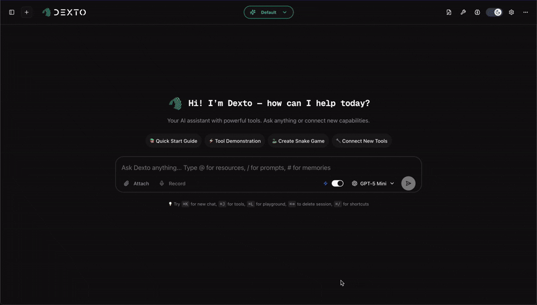

<a href="https://dexto.ai">
  <div align="center">
    <picture>
      <source media="(prefers-color-scheme: light)" srcset=".github/assets/dexto_logo_light.svg">
      <source media="(prefers-color-scheme: dark)" srcset=".github/assets/dexto_logo_dark.svg">
      
    </picture>
  </div>
</a>

<p align="center">
  
  
  <a href="https://discord.gg/GFzWFAAZcm"></a>
  <a href="https://deepwiki.com/truffle-ai/dexto"></a>
</p>

<p align="center"><b>An open agent harness for AI applications—ships with a powerful coding agent.</b></p>

<div align="center">
  
</div>

---

## What is Dexto?

Dexto is an **agent harness**—the orchestration layer that turns LLMs into reliable, stateful agents that can take actions, remember context, and recover from errors.

Think of it like an operating system for AI agents:

| Component | Analogy | Role |
|-----------|---------|------|
| **LLM** | CPU | Raw processing power |
| **Context Window** | RAM | Working memory |
| **Dexto** | Operating System | Orchestration, state, tools, recovery |
| **Your Agent** | Application | Domain-specific logic and clients |

### Why Dexto?

- **Configuration-driven**: Define agents in YAML. Swap models and tools without touching code.
- **Batteries included**: Session management, tool orchestration, memory, multimodal support, and observability—out of the box.
- **Run anywhere**: Local, cloud, or hybrid. CLI, Web UI, REST API, Discord, Telegram, or embedded in your app.

### What You Can Build

- **Coding Agents** – Build, debug, and refactor code autonomously
- **Autonomous Agents** – Plan, execute, and adapt to user goals
- **Digital Companions** – Assistants that remember context and anticipate needs
- **MCP Clients & Servers** – Connect tools, files, APIs via Model Context Protocol
- **Multi-Agent Systems** – Agents that collaborate, delegate, and solve complex tasks together

---

## Coding Agent

Dexto ships with a **production-ready coding agent** you can use immediately via the CLI or Web UI.

```bash
# Launch the coding agent (default)
dexto

# Or explicitly
dexto --agent coding-agent
```

**What it can do:**
- Build new apps from scratch
- Read, write, and refactor code across your entire codebase
- Execute shell commands and run tests
- Spawn specialized sub-agents for exploration and planning
- Remember context across sessions with persistent memory
- Work with any of 50+ LLMs (swap models mid-conversation)

**Ready-to-use interfaces:**
- **Web UI** – Chat interface with file uploads, syntax highlighting, and MCP tool browser
- **CLI** – Terminal-native with `/commands`, streaming output, and session management

The coding agent is just one example of what you can build. Create your own agents by defining a YAML config—same architecture, your domain.

---

## Quick Start

### Install

```bash
# Install globally via npm
npm install -g dexto

# Or build from source
git clone https://github.com/truffle-ai/dexto.git
cd dexto && pnpm install && pnpm install-cli
```

### Run

```bash
# Start Dexto (launches setup wizard on first run)
dexto
```

**More options:**

```bash
dexto --mode cli                                   # Terminal mode
dexto -p "create a landing page for a coffee shop" # One-shot task
dexto --auto-approve "refactor this codebase"      # Skip confirmations
dexto -m claude-sonnet-4-5-20250929                # Switch models
dexto --help                                       # Explore all options
```

**Inside the interactive CLI**, type `/` to explore commands—switch models, manage sessions, configure tools, and more.

### Manage Settings

```bash
# Configure defaults like LLM provider/model, API keys, or download local models
dexto setup
```

Logs are stored in `~/.dexto/logs/`. Use `DEXTO_LOG_LEVEL=debug` for verbose output.

---

## Core Features

### 50+ LLMs, Instant Switching

Switch models mid-conversation—no code changes, no restarts.

| Provider | Models |
|----------|--------|
| **OpenAI** | gpt-5.2, gpt-5.2-pro, gpt-5.2-codex, o4-mini |
| **Anthropic** | Claude Sonnet, Opus, Haiku (with extended thinking) |
| **Google** | Gemini 3 Pro, 2.5 Pro/Flash |
| **Groq** | Llama 4, Qwen, DeepSeek |
| **xAI** | Grok 4, Grok 3 |
| **Local** | Ollama, GGUF via node-llama-cpp (Llama, Qwen, Mistral, etc.) |
| **+ Gateways** | OpenRouter, AWS Bedrock, Vertex AI, LiteLLM |

**Run locally for privacy**: Local models keep data on your machine with automatic GPU detection (Metal, CUDA, Vulkan).

### MCP Integration (30+ Tools)

Connect to Model Context Protocol servers—Puppeteer, Linear, ElevenLabs, Firecrawl, Sora, and more.

```yaml
# agents/my-agent.yml
mcpServers:
  filesystem:
    type: stdio
    command: npx
    args: ['-y', '@modelcontextprotocol/server-filesystem', '.']
  browser:
    type: stdio
    command: npx
    args: ['-y', '@anthropics/mcp-server-puppeteer']
```

Browse and add servers from the MCP Store in the Web UI or via `/mcp` commands in the CLI.

### Human-in-the-Loop Controls

Fine-grained control over what your agent can do:

```yaml
toolConfirmation:
  mode: manual           # Require approval for each tool
  # mode: auto-approve   # Trust mode for local development
  toolPolicies:
    alwaysAllow:
      - mcp--filesystem--read_file
      - mcp--filesystem--list_directory
    alwaysDeny:
      - mcp--filesystem--delete_file
```

Agents remember which tools you've approved per session.

### Persistent Sessions & Memory

Conversations persist across restarts. Create memories that shape agent behavior.

```bash
# Continue last conversation
dexto -c

# Resume specific session
dexto -r session-abc123

# Search across all conversations
dexto search "database schema"
```

### Multi-Agent Systems

Agents can spawn specialized sub-agents to handle complex subtasks. The coding agent uses this to delegate exploration:

```yaml
# In your agent config
customTools:
  - type: agent-spawner
    allowedAgents: ["explore-agent"]
    maxConcurrentAgents: 5
    defaultTimeout: 300000  # 5 minutes
```

**Built-in sub-agents:**
- **explore-agent** – Fast, read-only codebase exploration

Any agent in the [Agent Registry](#agent-registry) can be spawned as a sub-agent—including custom agents you create and register.

Sub-agents run ephemerally, auto-cleanup after completion, and forward tool approvals to the parent—so users see one unified approval flow.

---

## Run Modes

| Mode | Command | Use Case |
|------|---------|----------|
| **Web UI** | `dexto` | Chat interface with file uploads (default) |
| **CLI** | `dexto --mode cli` | Terminal interaction |
| **Web Server** | `dexto --mode server` | REST & SSE APIs |
| **MCP Server** | `dexto --mode mcp` | Expose agent as an MCP server over stdio |

Platform integrations: [Discord](examples/discord-bot/), [Telegram](examples/telegram-bot/)

<details>
<summary><strong>Dexto as an MCP Server</strong></summary>

#### Transport: `stdio`

Connect your Dexto agent as an MCP server in Claude Code or Cursor:

```bash
dexto --mode mcp --auto-approve --no-elicitation                # Default agent
dexto --mode mcp --agent coding-agent --auto-approve --no-elicitation
npx dexto --mode mcp --agent coding-agent --auto-approve --no-elicitation
```

Example MCP config for Claude Code or Cursor:

```json
{
  "command": "npx",
  "args": ["-y", "dexto", "--mode", "mcp", "--agent", "coding-agent", "--auto-approve", "--no-elicitation"]
}
```

`--auto-approve` and `--no-elicitation` are required for MCP mode since it runs non-interactively.

#### Transport: `http/sse`

`dexto --mode server` exposes your agent as an MCP server at `/mcp` for remote clients:

```bash
dexto --mode server --port 3001
ngrok http 3001  # Optional: expose publicly
```

</details>

---

## Dexto Agents SDK

Build AI agents programmatically. Everything the CLI does, your code can too.

```bash
npm install @dexto/core
```

```typescript
import { DextoAgent } from '@dexto/core';

const agent = new DextoAgent({
  llm: { provider: 'openai', model: 'gpt-5-mini', apiKey: process.env.OPENAI_API_KEY }
});
await agent.start();

const session = await agent.createSession();
const response = await agent.generate('What is TypeScript?', session.id);
console.log(response.content);

// Streaming
for await (const event of await agent.stream('Write a story', session.id)) {
  if (event.name === 'llm:chunk') process.stdout.write(event.content);
}

// Multimodal
await agent.generate([
  { type: 'text', text: 'Describe this image' },
  { type: 'image', image: base64Data, mimeType: 'image/png' }
], session.id);

// Switch models mid-conversation
await agent.switchLLM({ model: 'claude-sonnet-4-5-20250929' });
```

**Start a server programmatically:**

Start a Dexto server programmatically to expose REST and SSE streaming APIs to interact and manage your agent backend.

```typescript
import { DextoAgent } from '@dexto/core';
import { loadAgentConfig, startHonoApiServer } from 'dexto';

const config = await loadAgentConfig('./agents/my-agent.yml');
const agent = new DextoAgent(config);
const { server } = await startHonoApiServer(agent, 3001);
// POST /api/message, GET /api/sessions, etc.
```

This starts an HTTP server with full REST and SSE APIs, enabling integration with web frontends, webhooks, and other services. See the [REST API Documentation](https://docs.dexto.ai/api/rest/) for available endpoints.

<details>
<summary><strong>Advanced SDK Usage</strong></summary>

### Session Management

Create and manage multiple conversation sessions with persistent storage.

```typescript
const agent = new DextoAgent(config);
await agent.start();

// Create and manage sessions
const session = await agent.createSession('user-123');
await agent.generate('Hello, how can you help me?', session.id);

// List and manage sessions
const sessions = await agent.listSessions();
const history = await agent.getSessionHistory('user-123');
await agent.deleteSession('user-123');

// Search across conversations
const results = await agent.searchMessages('bug fix', { limit: 10 });
```

### LLM Management

Switch between models and providers dynamically.

```typescript
// Get current configuration
const currentLLM = agent.getCurrentLLMConfig();

// Switch models (provider inferred automatically)
await agent.switchLLM({ model: 'gpt-5-mini' });
await agent.switchLLM({ model: 'claude-sonnet-4-5-20250929' });

// Switch model for a specific session
await agent.switchLLM({ model: 'gpt-5-mini' }, 'session-123');

// Get supported providers and models
const providers = agent.getSupportedProviders();
const models = agent.getSupportedModels();
```

### MCP Manager

For advanced MCP server management, use the MCPManager directly.

```typescript
import { MCPManager } from '@dexto/core';

const manager = new MCPManager();

// Connect to MCP servers
await manager.connectServer('filesystem', {
  type: 'stdio',
  command: 'npx',
  args: ['-y', '@modelcontextprotocol/server-filesystem', '.']
});

// Access tools, prompts, and resources
const tools = await manager.getAllTools();
const prompts = await manager.getAllPrompts();
const resources = await manager.getAllResources();

// Execute tools
const result = await manager.executeTool('readFile', { path: './README.md' });

await manager.disconnectAll();
```

### Storage & Persistence

Configure storage backends for production.

```yaml
# agents/production-agent.yml
storage:
  cache:
    type: redis
    url: $REDIS_URL
  database:
    type: postgres
    connectionString: $POSTGRES_CONNECTION_STRING

sessions:
  maxSessions: 1000
  sessionTTL: 86400000  # 24 hours
```

**Supported Backends:**
- **Cache**: Redis, In-Memory
- **Database**: PostgreSQL, SQLite, In-Memory

See the [Storage Configuration guide](https://docs.dexto.ai/docs/guides/configuring-dexto/storage) for details.

</details>

---

## Agent Registry

Pre-built agents for common use cases:

```bash
# List available agents
dexto list-agents

# Install and run
dexto install coding-agent podcast-agent
dexto --agent coding-agent
```

**Available:** Coding, Podcast, Image Editor, Video (Sora), Database, GitHub, Triage (multi-agent), and more.

See the full [Agent Registry](https://docs.dexto.ai/docs/guides/agent-registry).

---

## Agent Configuration

Dexto treats each configuration as a unique agent allowing you to define and save combinations of LLMs, servers, storage options, etc. based on your needs for easy portability. Define agents in version-controlled YAML. Change the file, reload, and chat—state, memory, and tools update automatically.

```yaml
# agents/production-agent.yml
llm:
  provider: anthropic
  model: claude-sonnet-4-5-20250929
  apiKey: $ANTHROPIC_API_KEY

mcpServers:
  filesystem:
    type: stdio
    command: npx
    args: ['-y', '@modelcontextprotocol/server-filesystem', '.']

systemPrompt: |
  You are a helpful assistant with filesystem access.

storage:
  cache:
    type: redis
    url: $REDIS_URL
  database:
    type: postgres
    connectionString: $POSTGRES_CONNECTION_STRING

toolConfirmation:
  mode: manual
```

### LLM Providers

Switch between providers instantly—no code changes required.

#### Built-in Providers
| Provider | Models | Setup |
|----------|--------|-------|
| **OpenAI** | `gpt-5.2`, `gpt-5.2-pro`, `gpt-5.2-codex`, `o4-mini` | API key |
| **Anthropic** | `claude-sonnet-4-5-20250929`, `claude-opus-4-5-20250929`, extended thinking | API key |
| **Google** | `gemini-3-pro`, `gemini-2.5-pro`, `gemini-2.5-flash` | API key |
| **Groq** | `llama-4-scout`, `qwen-qwq`, `deepseek-r1-distill` | API key |
| **xAI** | `grok-4`, `grok-3`, `grok-3-fast` | API key |
| **Cohere** | `command-r-plus`, `command-r` | API key |

#### Local Models (Privacy-First)
| Provider | Models | Setup |
|----------|--------|-------|
| **Ollama** | Llama, Qwen, Mistral, DeepSeek, etc. | Local install |
| **node-llama-cpp** | Any GGUF model | Bundled (auto GPU detection: Metal, CUDA, Vulkan) |

#### Cloud Platforms
| Provider | Models | Setup |
|----------|--------|-------|
| **AWS Bedrock** | Claude, Llama, Mistral | AWS credentials |
| **Google Vertex AI** | Gemini, Claude | GCP credentials |

#### Gateway Providers
| Provider | Access | Setup |
|----------|--------|-------|
| **OpenRouter** | 100+ models from multiple providers | API key |
| **LiteLLM** | Unified API for any provider | Self-hosted or API key |
| **Glama** | Multi-provider gateway | API key |

```bash
# Switch models via CLI
dexto -m claude-sonnet-4-5-20250929
dexto -m gemini-2.5-pro
dexto -m llama-4-scout
```

Switch within interactive CLI (`/model`) or Web UI without config changes.

See the [Configuration Guide](https://docs.dexto.ai/docs/category/agent-configuration-guide).

---

## Demos & Examples

| Image Editor | MCP Store | Portable Agents |
|:---:|:---:|:---:|
|  |  |  |
| Face detection & annotation using OpenCV | Browse and add MCPs | Use agents in Cursor, Claude Code via MCP|

<details>
<summary><strong>More Examples</strong></summary>

### Coding Agent
Build applications from natural language:
```bash
dexto --agent coding-agent
# "Create a snake game and open it in the browser"
```


### Podcast Agent
Generate multi-speaker audio content:
```bash
dexto --agent podcast-agent
```


### Multi-Agent Triage
Coordinate specialized agents:
```bash
dexto --agent triage-agent
```


### Memory System
Persistent context that shapes behavior:


### Dynamic Forms
Agents generate forms for structured input:


### Browser Automation
<a href="https://youtu.be/C-Z0aVbl4Ik">
  
</a>

### MCP Playground
Test tools before deploying:


</details>

---

<details>
<summary><strong>CLI Reference</strong></summary>

```
Usage: dexto [options] [command] [prompt...]

Basic Usage:
  dexto                    Start web UI (default)
  dexto "query"            Run one-shot query
  dexto --mode cli         Interactive CLI

Session Management:
  dexto -c                 Continue last conversation
  dexto -r <id>            Resume specific session

Options:
  -a, --agent <path>       Agent config file or ID
  -m, --model <model>      LLM model to use
  --auto-approve           Skip tool confirmations
  --mode <mode>            web | cli | server | mcp
  --port <port>            Server port

Commands:
  setup                    Configure global preferences
  install <agents...>      Install agents from registry
  list-agents              List available agents
  session list|history     Manage sessions
  search <query>           Search conversation history
```

Full reference: `dexto --help`

</details>

---

## Documentation

- **[Quick Start](https://docs.dexto.ai/docs/getting-started/intro/)** – Get running in minutes
- **[Configuration Guide](https://docs.dexto.ai/docs/category/guides/)** – Agents, LLMs, tools
- **[SDK Reference](https://docs.dexto.ai/api/sdk/dexto-agent)** – Programmatic usage
- **[REST API](https://docs.dexto.ai/api/rest/)** – HTTP endpoints

---

## Telemetry

We collect anonymous usage data (no personal/sensitive info) to help improve Dexto. This includes:

- Commands used
- Command execution time
- Error occurrences
- System information (OS, Node version)
- LLM Models used

To opt-out:

Set env variable `DEXTO_ANALYTICS_DISABLED=1`

---

## Contributing

See [CONTRIBUTING.md](./CONTRIBUTING.md).

---

## Community

Built by [Truffle AI](https://www.trytruffle.ai). Join [Discord](https://discord.gg/GFzWFAAZcm) for support.

If you find Dexto useful, please give us a ⭐ on GitHub—it helps a lot!

[](https://x.com/intent/user?screen_name=dexto_ai)
[](https://x.com/intent/user?screen_name=Road_Kill11)
[](https://x.com/intent/user?screen_name=shaun5k_)

---

## Contributors

[](https://github.com/truffle-ai/dexto/graphs/contributors)

---

## License

Elastic License 2.0. See [LICENSE](LICENSE).
