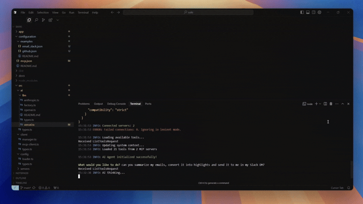

# Dexto

<p align="center">
  
  
  <a href="https://discord.gg/GFzWFAAZcm"></a>
  <a href="https://deepwiki.com/truffle-ai/dexto"></a>
</p>

**An all-in-one toolkit to build agentic applications that turn natural language into real-world actions.**

<div align="center">
  
</div>

## What is Dexto?

Dexto is a universal agent interface for building agentic apps—software that understands natural language and takes real-world actions. It orchestrates LLMs, tools, and data into persistent, stateful systems with memory, so you can rapidly create AI assistants, copilots, and context-aware apps that think, act and feel alive.

#### With Dexto, you can build:

- **Autonomous Agents** that plan, execute, and adapt to user goals.
- **Digital Companions** like AI assistants & copilots that remember context and anticipate needs.
- **Multi-Agent Systems** that collaborate, delegate, and solve complex tasks together.
- **MCP Clients** to connect multiple tools, files, APIs, and data via MCP Servers.
- **Agent-as-a-Service** – Transform your existing SaaS products and APIs into dynamic, conversational experiences.
- **Agentic Applications** – Integrate Dexto as a reasoning engine to power interactive, multimodal, AI-native applications.

<!-- Dexto unifies a configuration-driven framework, robust runtime, and seamless developer experience—so you can build, deploy, and iterate with ease.

- **Framework** – Define agent behavior in YAML. Instantly swap models and tools without touching code.
- **Runtime** – Execution with session management, conversation memory, and multimodal support.
- **Interfaces & Tooling** – Native support for CLI, Web, APIs, and a TypeScript SDK. Develop, debug, and interact with your agent across any platforms from day one. -->

### What You Get

- **Batteries Included** – Session management, tool orchestration, multimodal support.
- **20+ LLMs** – Instantly switch between OpenAI, Anthropic, Google, Groq, local models or bring your own.
- **Run Anywhere** – Local for privacy, cloud for reach, or hybrid. *Same agent, any deployment.*
- **Native Multimodal** – Text, images, files, and tools in a single conversation. *Upload screenshots, ask questions, take actions.*
- **Persistent Sessions** – Conversations, context, and memory are saved and can be exported, imported, or shared across environments.
- **Flexible Interfaces** – One agent, endless ways to interact: CLI, Web, Discord, Telegram, APIs, or integrate with your own UI.
- **Production Ready** – Observability and error handling built-in.
- **Tooling & MCP** – Integrate 100+ tools and connect to external servers via the Model Context Protocol (MCP).
- **Customizable Agents** – Define agent behavior, tools, and prompts in YAML or TypeScript.
- **Pluggable Storage** – Use Redis, PostgreSQL, SQLite, in-memory, and more for cache and database backends.

---

## Installation

```bash
# NPM global
npm install -g dexto

# —or— build from source
git clone https://github.com/truffle-ai/dexto.git
cd dexto && npm i && npm run build && npm link
```

## Quick Start

```bash
# 1. Set your API key
export OPENAI_API_KEY=your_openai_api_key_here

# 2. Try a multi-step task
dexto "create a snake game in HTML/CSS/JS, then open it in the browser"

# Optional: Launch the Web UI
dexto --mode web
```

Dexto will use filesystem tools to write code and browser tools to open it—all from a single prompt. The Web UI allows you to navigate previous conversations and experiment with different models, tools and more.

## Examples & Demos

### 🛒 Amazon Shopping Assistant
**Task:** `Can you go to amazon and add some snacks to my cart? I like trail mix, cheetos and maybe surprise me with something else?`
```bash
# Default agent has browser tools
dexto
```
<a href="https://youtu.be/C-Z0aVbl4Ik">
  
</a>


### 📧 Send Email Summaries to Slack
**Task:** `Summarize emails and send highlights to Slack`
```bash
dexto --agent ./agents/examples/email_slack.yml
```


---

## Run Modes

| Mode | Command | Best for |
|------|---------|----------|
| **Interactive CLI** | `dexto` | Everyday automation & quick tasks |
| **Web UI** | `dexto --mode web` | Friendly chat interface w/ image support |
| **Headless Server** | `dexto --mode server` | REST & WebSocket APIs for agent interaction |
| **MCP Server (Agent)** | `dexto --mode mcp` | Exposing your agent as a tool for others via stdio |
| **MCP Server (Aggregator)** | `dexto mcp --group-servers` | Re-exposing tools from multiple MCP servers via stdio |
| **Discord Bot** | `dexto --mode discord` | Community servers & channels ([Requires Setup](src/app/discord/README.md)) |
| **Telegram Bot** | `dexto --mode telegram` | Mobile chat ([Requires Setup](src/app/telegram/README.md)) |

Run `dexto --help` for **all flags, sub-commands, and environment variables**.

## Configuration

### Agent Configuration

Dexto treats each configuration as a unique agent allowing you to define and save combinations of LLMs, servers, storage options, etc. based on your needs for easy portability. Define agents in version-controlled YAML. Change the file, reload, and chat—state, memory, and tools update automatically.

```yaml
# agents/my-agent.yml
llm:
  provider: openai
  model: gpt-4.1-mini
  apiKey: $OPENAI_API_KEY

mcpServers:
  filesystem:
    type: stdio
    command: npx
    args: ['-y', '@modelcontextprotocol/server-filesystem', '.']
  web:
    type: stdio
    command: npx
    args: ['-y', '@modelcontextprotocol/server-brave-search']

systemPrompt: |
  You are a helpful AI assistant with access to files and web search.
```

### LLM Providers

Switch between providers instantly—no code changes required.

| Provider | Models | Setup |
|----------|--------|-------|
| **OpenAI** | `gpt-5`, `gpt-4.1`, `gpt-4o`, `o3`, `o1` | `export OPENAI_API_KEY=...` |
| **Anthropic** | `claude-4-sonnet`, `claude-4-opus`, `claude-3.5-sonnet` | `export ANTHROPIC_API_KEY=...` |
| **Google** | `gemini-2.5-pro`, `gemini-2.5-flash`, `gemini-2.0-flash` | `export GOOGLE_GENERATIVE_AI_API_KEY=...` |
| **Groq** | `llama-3.3-70b-versatile`, `llama-4-scout`, `qwen3-32b` | `export GROQ_API_KEY=...` |
| **xAI** | `grok-4`, `grok-3`, `grok-3-mini` | `export XAI_API_KEY=...` |
| **Cohere** | `command-a-03-2025`, `command-r-plus`, `command-r` | `export COHERE_API_KEY=...` |

```bash
# Switch models via CLI
dexto -m claude-4-sonnet-20250514
dexto -m gemini-2.5-pro
```

See our [Configuration Guide](https://docs.dexto.ai/category/dexto-configuration-guide) for complete setup instructions.

## Agent Recipes

Dexto comes with pre-built agent recipes for common use cases. Install and use them instantly:

```bash
# List available agents
dexto list-agents

# Install specific agents
dexto install nano-banana-agent podcast-agent

# Use an agent
dexto --agent nano-banana-agent "create a futuristic cityscape with flying cars"
dexto --agent podcast-agent "generate a podcast intro with two hosts discussing AI"
```

**Available Agents:**
- **Database Agent** – Demo agent for SQL queries and database operations
- **Image Editor Agent** – Image editing and manipulation  
- **Music Agent** – Music creation and audio processing
- **PDF Agent** – Document analysis and conversation
- **Product Researcher** – Product naming and branding research
- **Triage Agent** – Demo multi-agent customer support routing system
- **Nano Banana Agent** – Advanced image generation and editing using Google's Nano Banana (Gemini 2.5 Flash Image)
- **Podcast Agent** – Advanced podcast generation using Google Gemini TTS for multi-speaker audio content

Each agent is pre-configured with the right tools, prompts, and LLM settings for its domain. No setup required—just install and start building.

More ready-to-run recipes live in [`agents/`](agents/) and the [docs site](https://docs.dexto.ai/).


## Programmatic API

Build applications with the `DextoAgent` class. Everything the CLI can do, your code can too.

```ts
import { DextoAgent } from 'dexto';

// Create and start agent
const agent = new DextoAgent({
  llm: {
    provider: 'openai',
    model: 'gpt-4.1-mini',
    apiKey: process.env.OPENAI_API_KEY
  }
});
await agent.start();

// Run tasks
const response = await agent.run('List the 5 largest files in this repo');
console.log(response);

// Hold conversations
await agent.run('Write a haiku about TypeScript');
await agent.run('Make it funnier');

await agent.stop();
```

See our [TypeScript SDK docs](https://docs.dexto.ai/api/category/typescript-sdk) for complete examples with MCP tools, sessions, and advanced features.

---

## Advanced Usage

### Session Management

Create and manage multiple conversation sessions with persistent storage.

```typescript
const agent = new DextoAgent(config);
await agent.start();

// Create and manage sessions
const session = await agent.createSession('user-123');
await agent.run('Hello, how can you help me?', undefined, 'user-123');

// List and manage sessions
const sessions = await agent.listSessions();
const sessionHistory = await agent.getSessionHistory('user-123');
await agent.deleteSession('user-123');

// Search across conversations
const results = await agent.searchMessages('bug fix', { limit: 10 });
```

### LLM Management

Switch between models and providers dynamically.

```typescript
// Get current configuration
const currentLLM = agent.getCurrentLLMConfig();

// Switch models (provider inferred automatically)
await agent.switchLLM({ model: 'gpt-4.1-mini' });
await agent.switchLLM({ model: 'claude-4-sonnet-20250514' });

// Get supported providers and models
const providers = agent.getSupportedProviders();
const models = agent.getSupportedModels();
const openaiModels = agent.getSupportedModelsForProvider('openai');
```

### MCP Manager

For advanced MCP server management, use the MCPManager directly.

```typescript
import { MCPManager } from 'dexto';

const manager = new MCPManager();

// Connect to MCP servers
await manager.connectServer('filesystem', {
  type: 'stdio',
  command: 'npx',
  args: ['-y', '@modelcontextprotocol/server-filesystem', '.']
});

// Access tools, prompts, and resources
const tools = await manager.getAllTools();
const prompts = await manager.getAllPrompts();
const resources = await manager.getAllResources();

// Execute tools
const result = await manager.executeTool('readFile', { path: './README.md' });

await manager.disconnectAll();
```

### Storage & Persistence

Configure storage backends for production-ready persistence and caching.

```yaml
# agents/production-agent.yml
storage:
  cache:
    type: redis
    url: $REDIS_URL
    maxConnections: 100
  database:
    type: postgres
    connectionString: $POSTGRES_CONNECTION_STRING
    maxConnections: 25

sessions:
  maxSessions: 1000
  sessionTTL: 86400000 # 24 hours
```

**Supported Backends:**
- **Cache**: Redis, In-Memory (fast, ephemeral)
- **Database**: PostgreSQL, SQLite, In-Memory (persistent, reliable)

**Use Cases:**
- **Development**: In-memory for quick testing
- **Production**: Redis + PostgreSQL for scale
- **Simple**: SQLite for single-instance persistence

See the [DextoAgent API Documentation](https://docs.dexto.ai/api/dexto-agent) for complete method references.

---

## CLI Reference

<details>
<summary>Click to expand for full CLI reference (`dexto --help`)</summary>

```
Usage: dexto [options] [command] [prompt...]

Dexto CLI allows you to talk to Dexto, build custom AI Agents, build complex AI applications like Cursor, and more.

Run dexto interactive CLI with `dexto` or run a one-shot prompt with `dexto -p "<prompt>"` or `dexto "<prompt>"`
Start with a new session using `dexto --new-session [sessionId]`
Run dexto web UI with `dexto --mode web`
Run dexto as a server (REST APIs + WebSockets) with `dexto --mode server`
Run dexto as a discord bot with `dexto --mode discord`
Run dexto as a telegram bot with `dexto --mode telegram`
Run dexto agent as an MCP server with `dexto --mode mcp`
Run dexto as an MCP server aggregator with `dexto mcp --group-servers`

Check subcommands for more features. Check https://github.com/truffle-ai/dexto for documentation on how to customize dexto and other examples

Arguments:
  prompt                           Natural-language prompt to run once. If not passed, dexto will start as an interactive CLI

Options:
  -v, --version                    output the current version
  -a, --agent <name|path>          Agent name or path to agent config file
  -p, --prompt <text>              One-shot prompt text. Alternatively provide a single quoted string as positional argument.
  -s, --strict                     Require all server connections to succeed
  --no-verbose                     Disable verbose output
  --no-interactive                 Disable interactive prompts and API key setup
  -m, --model <model>              Specify the LLM model to use
  -r, --router <router>            Specify the LLM router to use (vercel or in-built)
  --new-session [sessionId]        Start with a new session (optionally specify session ID)
  --mode <mode>                    The application in which dexto should talk to you - cli | web | server | discord | telegram | mcp (default: "cli")
  --web-port <port>                optional port for the web UI (default: "3000")
  --no-auto-install                Disable automatic installation of missing agents from registry
  -h, --help                       display help for command

Commands:
  create-app                       Scaffold a new Dexto Typescript app
  init-app                         Initialize an existing Typescript app with Dexto
  setup [options]                  Configure global Dexto preferences
  install [options] [agents...]    Install agents from the registry
  uninstall [options] [agents...]  Uninstall agents from the local installation
  list-agents [options]            List available and installed agents
  which <agent>                    Show the path to an agent
  mcp [options]                    Start Dexto as an MCP server. Use --group-servers to aggregate and re-expose tools from configured MCP servers.
```
</details>

---

## Next Steps

* **[Quick Start](https://docs.dexto.ai/getting-started/intro)** – Get up and running in minutes.
* **[Configuration Guide](https://docs.dexto.ai/category/guides)** – Configure agents, LLMs, and tools.
* **[Building with Dexto](https://docs.dexto.ai/category/tutorials)** – Developer guides and patterns.
* **[API Reference](https://docs.dexto.ai/api)** – REST APIs, WebSocket, and SDKs.

---

## Contributing

We welcome contributions! Refer to our [Contributing Guide](./CONTRIBUTING.md) for more details.

## Community & Support

Dexto is built by the team at [Truffle AI](https://www.trytruffle.ai).  
Join our Discord to share projects, ask questions, or just say hi!

[](https://discord.gg/GFzWFAAZcm)

If you enjoy Dexto, please give us a ⭐ on GitHub—it helps a lot!

 <div align="left"/>

[](https://x.com/intent/user?screen_name=Road_Kill11)
[](https://x.com/intent/user?screen_name=shaun5k_)

</div>

---

## Contributors

Thanks to all these amazing people for contributing to Dexto!

[](https://github.com/truffle-ai/dexto/graphs/contributors)

---

## License

Elastic License 2.0.  See [LICENSE](LICENSE) for full terms.