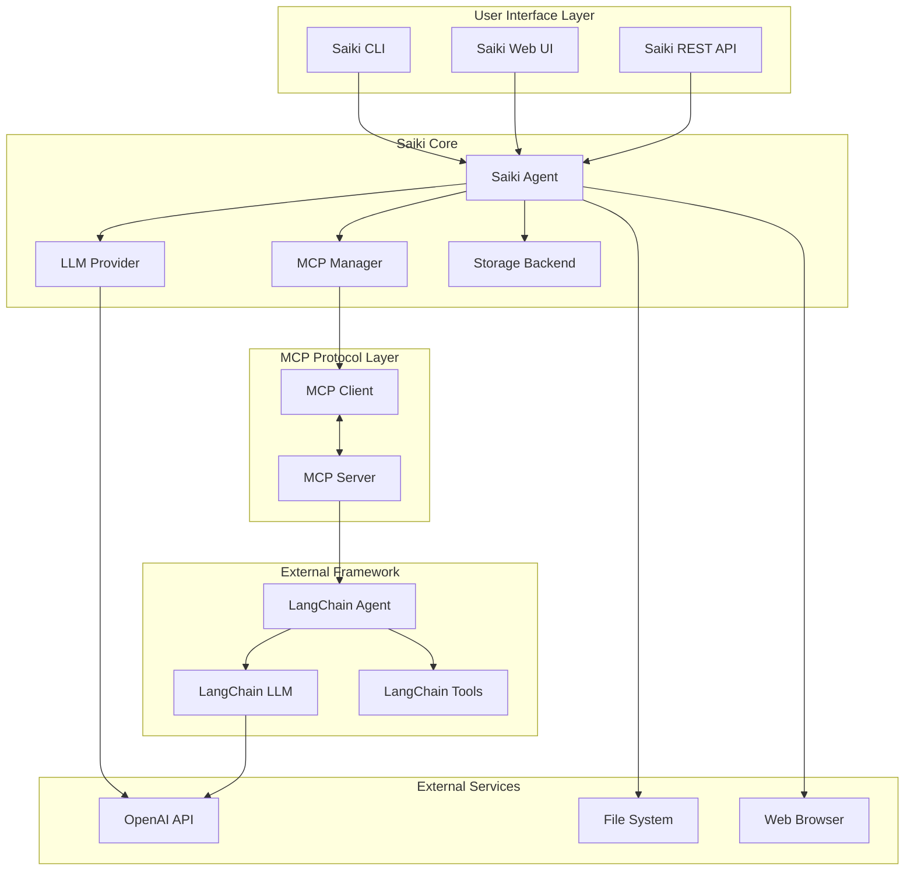
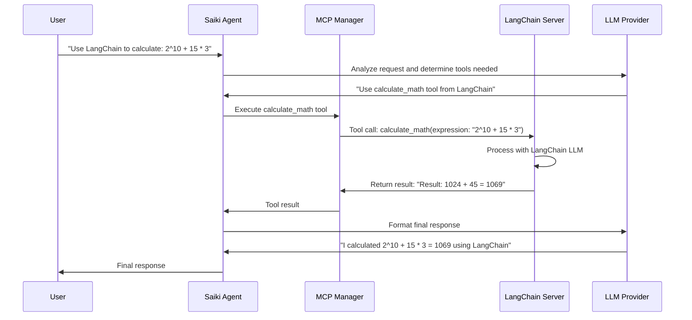
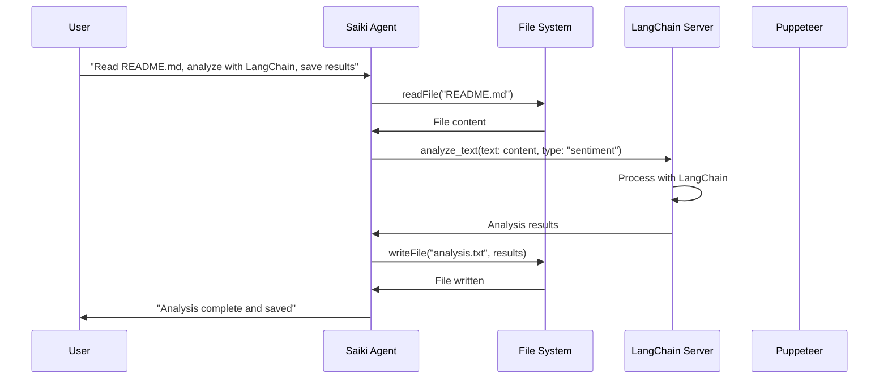

# Architecture Overview

This document provides a detailed explanation of the architecture for connecting external AI frameworks to Saiki via MCP.

## High-Level Architecture



## Component Details

### 1. Saiki Core Components

#### Saiki Agent (`SA`)
- **Purpose**: Main orchestration engine
- **Responsibilities**:
  - Processes user requests
  - Coordinates between different tools and frameworks
  - Manages conversation state
  - Routes requests to appropriate tools

#### MCP Manager (`MCPM`)
- **Purpose**: Manages connections to MCP servers
- **Responsibilities**:
  - Establishes and maintains MCP connections
  - Routes tool calls to appropriate servers
  - Handles connection failures and retries
  - Provides unified interface to all MCP tools

#### LLM Provider (`LLM`)
- **Purpose**: Provides AI reasoning capabilities
- **Responsibilities**:
  - Generates responses using configured LLM
  - Handles conversation context
  - Manages token limits and message history

### 2. MCP Protocol Layer

#### MCP Client (`MCP_CLIENT`)
- **Purpose**: Communicates with MCP servers
- **Responsibilities**:
  - Establishes stdio/HTTP/SSE connections
  - Sends tool execution requests
  - Receives and parses responses
  - Handles protocol-level errors

#### MCP Server (`MCP_SERVER`)
- **Purpose**: Exposes external framework functionality
- **Responsibilities**:
  - Registers tools with MCP protocol
  - Handles incoming tool requests
  - Delegates to underlying framework
  - Returns standardized responses

### 3. External Framework (LangChain)

#### LangChain Agent (`LC`)
- **Purpose**: Provides specialized AI capabilities
- **Responsibilities**:
  - Executes LangChain-specific operations
  - Manages LangChain chains and prompts
  - Handles framework-specific logic

#### LangChain LLM (`LC_LLM`)
- **Purpose**: Provides AI capabilities to LangChain
- **Responsibilities**:
  - Processes LangChain prompts
  - Generates responses
  - Manages LangChain-specific context

## Data Flow

### 1. User Request Processing



### 2. Multi-Framework Orchestration



## Configuration Structure

### Saiki Agent Configuration

```yaml
# saiki-agent-with-langchain.yml
systemPrompt:
  contributors:
    - id: primary
      type: static
      priority: 0
      content: |
        You are a Saiki AI agent with access to LangChain tools...
        
mcpServers:
  # Standard Saiki tools
  filesystem:
    type: stdio
    command: npx
    args: ["-y", "@modelcontextprotocol/server-filesystem", "."]
    
  # External LangChain framework
  langchain:
    type: stdio
    command: node
    args: ["./langchain-mcp-server.js"]
    env:
      OPENAI_API_KEY: $OPENAI_API_KEY
    timeout: 30000
    connectionMode: strict

llm:
  provider: openai
  model: gpt-4o-mini
  apiKey: $OPENAI_API_KEY
```

### LangChain MCP Server Configuration

```javascript
// langchain-mcp-server.js
class LangChainMCPServer {
    constructor() {
        this.server = new McpServer(
            { name: 'langchain-agent', version: '1.0.0' },
            { capabilities: { tools: {}, resources: {} } }
        );
        
        this.llm = new ChatOpenAI({
            modelName: 'gpt-3.5-turbo',
            temperature: 0.7,
        });
        
        this.registerTools();
    }
    
    registerTools() {
        // Register LangChain tools as MCP tools
        this.server.tool('calculate_math', '...', {...}, async ({ expression }) => {
            // LangChain processing logic
        });
    }
}
```

## Benefits of This Architecture

### 1. Framework Interoperability
- **Standard Protocol**: MCP provides a common interface
- **Language Agnostic**: Can connect frameworks written in different languages
- **Version Independent**: Framework versions can evolve independently

### 2. Modularity
- **Separation of Concerns**: Each framework handles its own domain
- **Independent Development**: Teams can work on different frameworks
- **Easy Testing**: Components can be tested in isolation

### 3. Scalability
- **Horizontal Scaling**: Add more frameworks without changing Saiki
- **Load Distribution**: Distribute processing across multiple servers
- **Fault Tolerance**: Individual framework failures don't affect others

### 4. Maintainability
- **Clear Boundaries**: Well-defined interfaces between components
- **Easy Debugging**: Issues can be isolated to specific frameworks
- **Documentation**: Each component has clear responsibilities

## Security Considerations

### 1. API Key Management
- **Environment Variables**: Sensitive keys passed via environment
- **Isolation**: Each framework manages its own credentials
- **Audit Trail**: All tool calls are logged

### 2. Tool Execution
- **Validation**: Input validation at multiple levels
- **Sandboxing**: External frameworks run in isolated processes
- **Timeouts**: Prevents hanging operations

### 3. Data Privacy
- **Local Processing**: Sensitive data stays on local machines
- **No Persistent Storage**: External frameworks don't store data
- **Clear Data Flow**: Transparent data handling

## Performance Considerations

### 1. Connection Management
- **Connection Pooling**: Reuse connections when possible
- **Lazy Loading**: Only connect to frameworks when needed
- **Connection Monitoring**: Track connection health

### 2. Caching
- **Result Caching**: Cache frequently requested results
- **Tool Discovery**: Cache available tools
- **Configuration Caching**: Cache framework configurations

### 3. Parallel Processing
- **Async Operations**: Non-blocking tool execution
- **Concurrent Requests**: Handle multiple requests simultaneously
- **Resource Limits**: Prevent resource exhaustion

## Extension Points

### 1. Adding New Frameworks
1. Create MCP server for the framework
2. Add configuration to Saiki agent
3. Update system prompt with new capabilities
4. Test integration

### 2. Custom Tools
1. Extend framework MCP server
2. Register new tools
3. Update documentation
4. Add examples

### 3. Advanced Orchestration
1. Implement workflow patterns
2. Add conditional logic
3. Create composite tools
4. Add monitoring and metrics

## Monitoring and Observability

### 1. Logging
- **Structured Logs**: JSON-formatted log entries
- **Log Levels**: Different levels for different environments
- **Context Tracking**: Correlate requests across frameworks

### 2. Metrics
- **Tool Usage**: Track which tools are used most
- **Performance**: Monitor response times
- **Errors**: Track failure rates and types

### 3. Health Checks
- **Connection Status**: Monitor MCP server health
- **Tool Availability**: Check tool availability
- **Resource Usage**: Monitor system resources

This architecture provides a robust foundation for connecting external AI frameworks to Saiki, enabling powerful multi-framework orchestration while maintaining clean separation of concerns and excellent extensibility. 