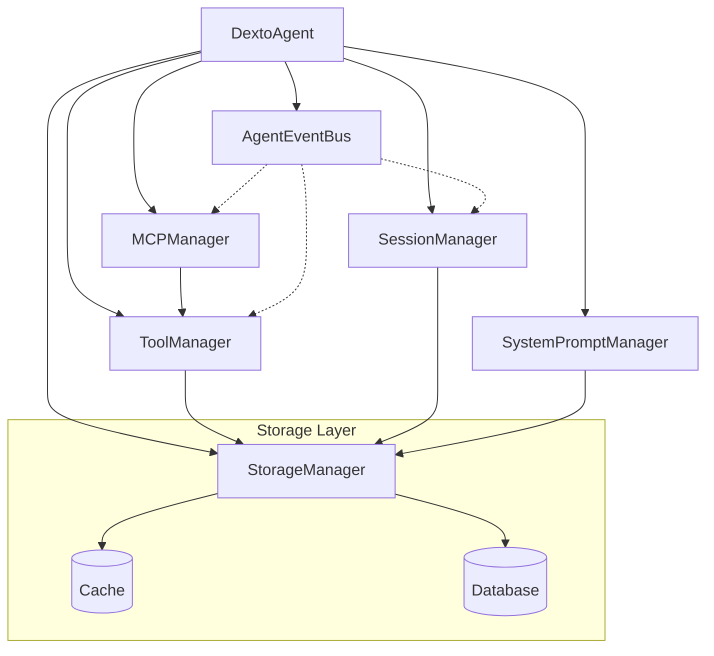

# Core Services

import ExpandableMermaid from '@site/src/components/ExpandableMermaid';

Dexto's architecture is built around core services that handle different aspects of agent functionality. Understanding these services helps with debugging, customization, and troubleshooting.

## Service Overview

| Service | Purpose | Key Responsibilities |
|---------|---------|---------------------|
| **DextoAgent** | Main orchestrator | Coordinates all services, handles user interactions |
| **MCPManager** | Tool coordination | Connects to MCP servers, manages tools and resources |
| **ToolManager** | Tool execution | Executes tools, handles confirmations, manages internal tools |
| **SessionManager** | Conversation state | Manages chat sessions, conversation history |
| **StorageManager** | Data persistence | Handles cache and database storage |
| **SystemPromptManager** | System prompts | Manages system prompt assembly and dynamic content |
| **AgentEventBus** | Event coordination | Handles inter-service communication |

## Service Relationships

<ExpandableMermaid title="Service Relationships Diagram">

</ExpandableMermaid>

## DextoAgent

**Main orchestrator** that coordinates all other services.

### Key Methods
- `start()` - Initialize all services
- `generate(message, options)` - Execute user prompt (recommended)
- `run(prompt, imageData?, fileData?, sessionId)` - Lower-level execution
- `switchLLM(updates)` - Change LLM model/provider
- `createSession(sessionId?)` - Create new chat session
- `stop()` - Shutdown all services

### Usage Example
```typescript
const agent = new DextoAgent(config);
await agent.start();

// Create a session
const session = await agent.createSession();

// Run a task
const response = await agent.generate("List files in current directory", session.id);
console.log(response.content);

// Switch models
await agent.switchLLM({ model: "claude-sonnet-4-5-20250929" });

await agent.stop();
```

## MCPManager

**Tool coordination** service that connects to Model Context Protocol servers.

### Key Methods
- `connectServer(name, config)` - Connect to MCP server
- `disconnectServer(name)` - Disconnect server
- `getAllTools()` - Get all available tools
- `executeTool(name, params)` - Execute specific tool

### Server Types
- **stdio** - Command-line programs
- **http** - HTTP REST endpoints  
- **sse** - Server-sent events

### Usage Example
```typescript
// Connect filesystem tools
await agent.mcpManager.connectServer('filesystem', {
  type: 'stdio',
  command: 'npx',
  args: ['-y', '@modelcontextprotocol/server-filesystem', '.']
});

// Get available tools
const tools = await agent.mcpManager.getAllTools();
```

## ToolManager

**Tool execution** service that handles tool calls and confirmations.

### Key Methods
- `getToolStats()` - Get tool counts (MCP + internal)
- `getAllTools()` - Get all available tools
- `executeTool(call)` - Execute tool with confirmation

### Tool Confirmation
Controls when users are prompted to approve tool execution:
- **auto** - Smart approval based on tool risk
- **always** - Always ask for confirmation  
- **never** - Never ask (auto-approve)

### Usage Example
```typescript
// Get tool statistics
const stats = await agent.toolManager.getToolStats();
console.log(`${stats.total} tools: ${stats.mcp} MCP, ${stats.internal} internal`);
```

## SessionManager

**Conversation state** management for persistent chat sessions.

### Key Methods
- `createSession(sessionId?)` - Create new session
- `getSession(sessionId)` - Retrieve existing session
- `listSessions()` - List all sessions
- `deleteSession(sessionId)` - Delete session
- `getSessionHistory(sessionId)` - Get conversation history
- `resetConversation(sessionId)` - Clear session history while keeping session active

### Session Features
- Persistent conversation history
- Session metadata (creation time, last activity)
- Cross-session search capabilities
- Export/import functionality

### Usage Example
```typescript
// Create new session
const session = await agent.createSession('work-session');

// List all sessions
const sessions = await agent.listSessions();

// Get conversation history
const history = await agent.getSessionHistory('work-session');

// Use session in conversations
const response = await agent.generate("Hello", session.id);
console.log(response.content);
```

## StorageManager

**Data persistence** using two-tier architecture.

### Storage Tiers
- **Cache** - Fast, ephemeral (Redis or in-memory)
- **Database** - Persistent, reliable (PostgreSQL, SQLite)

### Backends
| Backend | Use Case | Configuration |
|---------|----------|---------------|
| **in-memory** | Development, testing | No config needed |
| **sqlite** | Single instance, persistence | `path: ./data/dexto.db` |
| **postgres** | Production, scaling | `connectionString: $POSTGRES_URL` |
| **redis** | Fast caching | `url: $REDIS_URL` |

### Usage Pattern
```yaml
storage:
  cache:
    type: redis                    # Fast access
    url: $REDIS_URL
  database:
    type: postgres                 # Persistent storage
    connectionString: $POSTGRES_CONNECTION_STRING
```

## SystemPromptManager

**System prompt** assembly from multiple contributors.

### Contributor Types
- **static** - Fixed text content
- **dynamic** - Generated content (e.g., current date/time)  
- **file** - Content from files (.md, .txt)

### Priority System
Lower numbers execute first (0 = highest priority).

### Usage Example
```yaml
systemPrompt:
  contributors:
    - id: primary
      type: static
      priority: 0
      content: "You are a helpful AI assistant..."
    - id: date
      type: dynamic
      priority: 10
      source: date
    - id: context
      type: file
      priority: 5
      files: ["./docs/context.md"]
```

## AgentEventBus

**Event coordination** for inter-service communication.

### Event Types
- **llm:thinking** - AI is processing
- **llm:chunk** - Streaming response chunk
- **llm:tool-call** - Tool execution starting
- **llm:tool-result** - Tool execution completed  
- **llm:response** - Final response ready

### Usage Example
```typescript
agent.on('llm:tool-call', (event) => {
  console.log(`Executing tool: ${event.toolName}`);
});

agent.on('llm:response', (event) => {
  console.log(`Response: ${event.content}`);
});
```

## Service Initialization

Services are initialized automatically when `DextoAgent.start()` is called:

1. **Storage** - Cache and database connections
2. **Events** - Event bus setup
3. **Prompts** - System prompt assembly
4. **MCP** - Server connections
5. **Tools** - Tool discovery and validation
6. **Sessions** - Session management ready

## Debugging Services

### Log Levels
```bash
# Enable debug logging
DEXTO_LOG_LEVEL=debug dexto

# Service-specific debugging
DEXTO_LOG_LEVEL=silly dexto  # Most verbose
```

### Service Health Checks
```typescript
// Check MCP connections
const connectedServers = agent.mcpManager.getClients();
const failedConnections = agent.mcpManager.getFailedConnections();

// Check tool availability
const toolStats = await agent.toolManager.getToolStats();

// Check storage status
const storageHealth = agent.storageManager.getStatus();
```

### Common Issues
- **MCP connection failures** - Check command paths, network access
- **Storage errors** - Verify database/Redis connections
- **Tool execution timeouts** - Increase timeout in server config
- **Session persistence issues** - Check database backend health

## Service Configuration

Each service can be configured through the agent config:

```yaml
# MCP server connections
mcpServers:
  filesystem:
    type: stdio
    command: npx
    timeout: 30000

# Storage backends
storage:
  cache:
    type: redis
  database:
    type: postgres

# Session limits
sessions:
  maxSessions: 100
  sessionTTL: 3600000

# Permissions
permissions:
  mode: auto
  timeout: 30000
```

See [Configuration Guide](../guides/configuring-dexto/overview.md) for complete config options.
