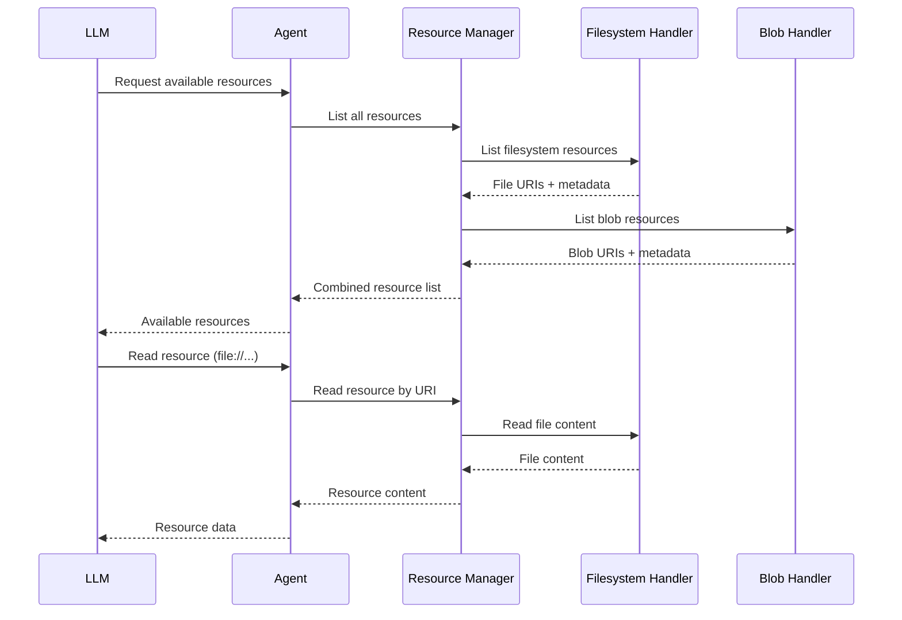

# Internal Resources

Internal resources allow your Dexto agent to expose files, data, and blob storage directly to the LLM as contextual information. Unlike MCP resources which come from external servers, internal resources are managed directly by your agent.

:::tip Quick Reference
For complete field documentation, see **[agent.yml → Internal Resources](./agent-yml#internal-resources)**.
:::

## Overview

Internal resources enable agents to:
- Provide files and directories as context to the LLM
- Expose blob storage contents (images, documents, etc.)
- Give LLMs access to local data without external servers
- Support rich context with multiple file types

Resources are accessed by the LLM through unique URIs and can include metadata like name, description, and MIME type.

## Resource Types

### Filesystem Resources

Expose files and directories from your local filesystem.

```yaml
internalResources:
  - type: filesystem
    paths:
      - ./docs
      - ./src/important-file.ts
    maxDepth: 3
    maxFiles: 1000
    includeHidden: false
    includeExtensions:
      - .md
      - .ts
      - .js
      - .json
```

**Configuration:**

| Field | Type | Default | Description |
|-------|------|---------|-------------|
| `type` | `"filesystem"` | *required* | Resource type identifier |
| `paths` | `string[]` | *required* | File paths or directories to expose (at least one required) |
| `maxDepth` | `number` | `3` | Maximum directory depth to traverse (1-10) |
| `maxFiles` | `number` | `1000` | Maximum number of files to include (1-10000) |
| `includeHidden` | `boolean` | `false` | Include hidden files and directories |
| `includeExtensions` | `string[]` | See below | File extensions to include |

**Default Extensions:**
`.txt`, `.md`, `.js`, `.ts`, `.json`, `.html`, `.css`, `.py`, `.yaml`, `.yml`, `.xml`, `.jsx`, `.tsx`, `.vue`, `.php`, `.rb`, `.go`, `.rs`, `.java`, `.kt`, `.swift`, `.sql`, `.sh`, `.bash`, `.zsh`

**URI Format:**
```
file:///absolute/path/to/file.ext
```

### Blob Resources

Expose blob storage contents managed by your agent's storage backend.

```yaml
storage:
  blob:
    type: in-memory  # or 'filesystem'
    maxSizeBytes: 10485760  # 10MB

internalResources:
  - type: blob
```

**Configuration:**

| Field | Type | Description |
|-------|------|-------------|
| `type` | `"blob"` | Enables blob storage resource provider |

:::note Storage Configuration
The blob resource provider only enables access to blobs. Actual storage settings (size limits, backend, cleanup) are configured in the `storage.blob` section of your agent config. See [Storage Configuration](./storage).
:::

**URI Format:**
```
blob://blob-id-here
```

Blobs are typically created by:
- Tool executions that generate files
- Plugin outputs
- User uploads (in WebUI mode)

## Configuration Patterns

### Simple Array Format

The simplest way to configure internal resources:

```yaml
internalResources:
  - type: filesystem
    paths: [./docs]
  - type: blob
```

This format automatically enables internal resources when the array is non-empty.

### Object Format with Explicit Control

For explicit enable/disable control:

```yaml
internalResources:
  enabled: true
  resources:
    - type: filesystem
      paths: [./docs]
    - type: blob
```

### Documentation-Only Agent

Perfect for documentation bots:

```yaml
internalResources:
  - type: filesystem
    paths:
      - ./documentation
      - ./api-specs
    maxDepth: 5
    maxFiles: 5000
    includeExtensions:
      - .md
      - .mdx
      - .json
      - .yaml
```

### Project Context Agent

Provide full project context:

```yaml
internalResources:
  - type: filesystem
    paths:
      - ./src
      - ./tests
      - ./README.md
      - ./package.json
    includeHidden: false
    includeExtensions:
      - .ts
      - .tsx
      - .js
      - .jsx
      - .json
      - .md
  - type: blob  # For generated artifacts
```

### Configuration Files Only

Limit to configuration files:

```yaml
internalResources:
  - type: filesystem
    paths: [./]
    maxDepth: 2
    includeExtensions:
      - .json
      - .yaml
      - .yml
      - .toml
      - .ini
      - .env.example
```

## How Resources Work

### Resource Discovery

1. Agent starts and initializes internal resource providers
2. Providers scan configured paths and enumerate available resources
3. Resources are exposed to the LLM with metadata (name, URI, description, MIME type)
4. LLM can request specific resources by URI when it needs context

### Resource Access Flow



### Resource Metadata

Each resource includes:

```typescript
{
  uri: string;           // Unique resource identifier
  name: string;          // Human-readable name
  description?: string;  // Optional description
  mimeType?: string;     // Optional MIME type (e.g., "text/markdown")
  source: "internal";    // Source indicator
}
```

## Best Practices

### Performance

1. **Limit scope** - Only expose necessary directories
2. **Set reasonable limits** - Use `maxDepth` and `maxFiles` to prevent scanning large trees
3. **Filter extensions** - Only include relevant file types
4. **Exclude generated files** - Skip `node_modules`, `dist`, `.git`, etc.

### Security

1. **Never expose secrets** - Exclude `.env`, `credentials.json`, private keys
2. **Use `.gitignore`-style patterns** - Hidden files are excluded by default
3. **Limit permissions** - Only expose read-only access
4. **Sanitize paths** - Avoid exposing sensitive system directories

### Organization

1. **Group by purpose** - Separate docs, code, configs
2. **Use descriptive paths** - Make it clear what each resource provides
3. **Document resources** - Add comments to explain what each resource is for
4. **Keep it focused** - Exposing everything adds noise; be selective

## Troubleshooting

### Resources Not Appearing

**Check configuration:**
- Verify `internalResources` is not empty
- Ensure `enabled: true` if using object format
- Confirm paths exist and are accessible

**Check logs:**
```bash
# Enable debug logging
DEXTO_LOG_LEVEL=debug dexto

# Check for resource initialization messages
# Look for "InternalResourcesProvider initialized" messages
```

### Too Many Files

If you hit `maxFiles` limit:
1. Reduce `maxDepth` to limit recursion
2. Be more selective with `paths`
3. Restrict `includeExtensions` to only needed types
4. Increase `maxFiles` if truly necessary (max: 10000)

### Performance Issues

If resource loading is slow:
1. Reduce `maxDepth` (try 2 instead of 3)
2. Lower `maxFiles` limit
3. Use more specific paths instead of broad directories
4. Consider excluding large binary files

## See Also

- [agent.yml → Internal Resources](./agent-yml#internal-resources) - Complete field documentation
- [Storage Configuration](./storage) - Blob storage backend settings
- [MCP Resources](../mcp/resources) - External MCP server resources
