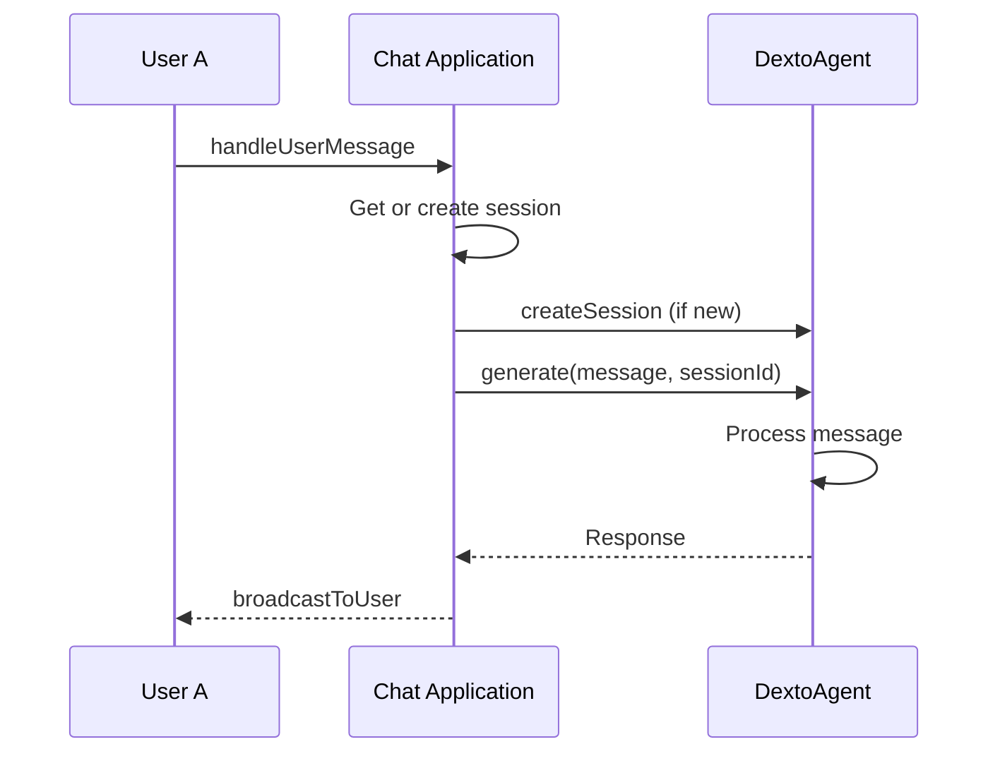
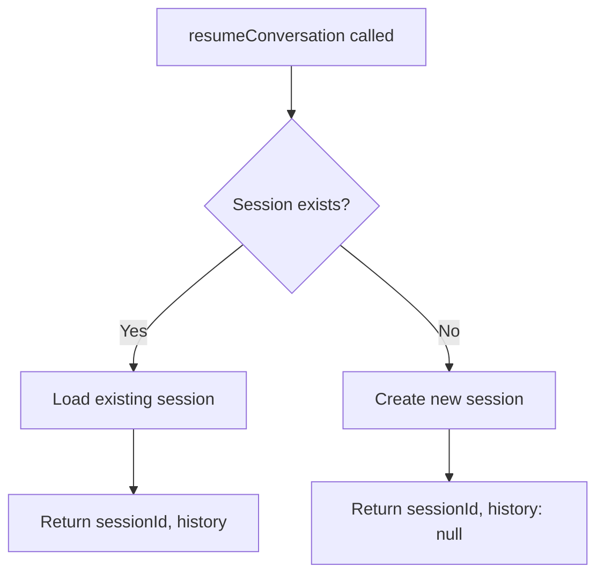

import ExpandableMermaid from '@site/src/components/ExpandableMermaid';

# Dexto Agent SDK Guide

Welcome to the Dexto Agent SDK guide for TypeScript. This guide provides everything you need to build high-quality AI applications with Dexto.

Whether you're creating standalone agents, integrating with existing applications, or building custom AI workflows, the SDK offers a flexible and robust set of tools.

## Key Features

- **Full TypeScript Support**: Strong typing for better development.

## Core Concepts

The SDK is built around a few core concepts:

- **DextoAgent**: The main class for creating and managing agents.
- **MCPManager**: A utility for managing MCP server connections.
- **LLMService**: A service for interacting with large language models.
- **StorageBackends**: A set of backends for persisting agent data.

## Example Usage

Here's a quick example of how to create a simple agent that uses the OpenAI API:

```typescript
import { DextoAgent } from '@dexto/core';

const agent = new DextoAgent({
  llm: {
    provider: 'openai',
    model: 'gpt-5',
    apiKey: process.env.OPENAI_API_KEY,
  }
});

await agent.start();

// Create a session for the conversation
const session = await agent.createSession();

// Use generate() for simple request/response
const response = await agent.generate('Hello, world!', session.id);
console.log(response.content);

await agent.stop();
```

For more detailed examples, see the [Examples](/examples/intro) section.

## Overview

The Dexto SDK provides a complete TypeScript library for building AI agents with MCP (Model Context Protocol) integration. It offers both high-level agent abstractions and low-level utilities for maximum flexibility.

### When to Use the SDK vs REST API

**Use the Dexto SDK when:**
- Building TypeScript applications
- Need real-time event handling
- Want type safety and IDE support
- Require complex session management
- Building long-running applications

**Use the REST API when:**
- Working in other languages
- Building simple integrations
- Prefer stateless interactions
- Working with webhooks or serverless functions

## Installation

```bash
npm install dexto
```

## Quick Start

### Basic Agent Setup

```typescript
import { DextoAgent } from '@dexto/core';

// Create agent with minimal configuration
const agent = new DextoAgent({
  llm: {
    provider: 'openai',
    model: 'gpt-5',
    apiKey: process.env.OPENAI_API_KEY
  }
});
await agent.start();

// Create a session and start a conversation
const session = await agent.createSession();
const response = await agent.generate('Hello! What can you help me with?', session.id);
console.log(response.content);
```

### Adding MCP Tools

```typescript
const agent = new DextoAgent({
  llm: {
    provider: 'openai',
    model: 'gpt-5',
    apiKey: process.env.OPENAI_API_KEY
  },
  toolConfirmation: { mode: 'auto-approve' },
  mcpServers: {
    filesystem: {
      type: 'stdio',
      command: 'npx',
      args: ['-y', '@modelcontextprotocol/server-filesystem', '.']
    },
    web: {
      type: 'stdio',
      command: 'npx',
      args: ['-y', '@modelcontextprotocol/server-brave-search']
    }
  }
});
await agent.start();

// Create session and use the agent with filesystem and web search tools
const session = await agent.createSession();
const response = await agent.generate(
  'List the files in this directory and search for recent AI news',
  session.id
);
console.log(response.content);
```

## Core Concepts

### Agents vs Sessions

- **Agent**: The main AI system with configuration, tools, and state management
- **Session**: Individual conversation threads within an agent

```typescript
// Create an agent (one per application typically)
const agent = new DextoAgent(config);
await agent.start();

// Create multiple sessions for different conversations
const userSession = await agent.createSession('user-123');
const adminSession = await agent.createSession('admin-456');

// Each session maintains separate conversation history
await agent.generate('Help me with my account', userSession.id);
await agent.generate('Show me system metrics', adminSession.id);
```

### Multimodal Content

Send text, images, and files using the `ContentPart[]` format:

```typescript
import { ContentPart } from '@dexto/core';

const session = await agent.createSession();

// Simple text (string shorthand)
await agent.generate('What is TypeScript?', session.id);

// Image from URL (auto-detected)
await agent.generate([
  { type: 'text', text: 'Describe this image' },
  { type: 'image', image: 'https://example.com/photo.jpg' }
], session.id);

// Image from base64
await agent.generate([
  { type: 'text', text: 'Describe this image' },
  { type: 'image', image: base64ImageData, mimeType: 'image/png' }
], session.id);

// File from URL
await agent.generate([
  { type: 'text', text: 'Summarize this document' },
  { type: 'file', data: 'https://example.com/report.pdf', mimeType: 'application/pdf' }
], session.id);

// File from base64
await agent.generate([
  { type: 'text', text: 'Summarize this document' },
  { type: 'file', data: base64PdfData, mimeType: 'application/pdf', filename: 'report.pdf' }
], session.id);

// Multiple attachments
await agent.generate([
  { type: 'text', text: 'Compare these two images' },
  { type: 'image', image: 'https://example.com/image1.png' },
  { type: 'image', image: 'https://example.com/image2.jpg' }
], session.id);
```

### Streaming Responses

Use `stream()` for real-time UIs that display text as it arrives:

```typescript
const session = await agent.createSession();

for await (const event of await agent.stream('Write a short story', session.id)) {
  switch (event.name) {
    case 'llm:thinking':
      console.log('Thinking...');
      break;
    case 'llm:chunk':
      process.stdout.write(event.content); // Stream text in real-time
      break;
    case 'llm:tool-call':
      console.log(`\n[Using tool: ${event.toolName}]`);
      break;
    case 'llm:response':
      console.log(`\n\nTotal tokens: ${event.tokenUsage?.totalTokens}`);
      break;
  }
}

// Streaming with multimodal content
for await (const event of await agent.stream([
  { type: 'text', text: 'Describe this image in detail' },
  { type: 'image', image: base64Image, mimeType: 'image/png' }
], session.id)) {
  if (event.name === 'llm:chunk') {
    process.stdout.write(event.content);
  }
}
```

### Event-Driven Architecture

The SDK provides real-time events for monitoring and integration:

```typescript
// Listen to agent-wide events
agent.agentEventBus.on('mcp:server-connected', (data) => {
  console.log(`✅ Connected to ${data.name}`);
});

// Listen to conversation events
agent.agentEventBus.on('llm:thinking', (data) => {
  console.log(`🤔 Agent thinking... (session: ${data.sessionId})`);
});

agent.agentEventBus.on('llm:tool-call', (data) => {
  console.log(`🔧 Using tool: ${data.toolName}`);
});
```

## Common Patterns

### Multi-User Chat Application

<ExpandableMermaid title="Multi-User Chat Flow">

</ExpandableMermaid>

```typescript
import { DextoAgent } from '@dexto/core';

class ChatApplication {
  private agent: DextoAgent;
  private userSessions = new Map<string, string>();

  async initialize() {
    this.agent = new DextoAgent({
      llm: { provider: 'openai', model: 'gpt-5', apiKey: process.env.OPENAI_API_KEY },
      toolConfirmation: { mode: 'auto-approve' },
      mcpServers: { /* your tools */ }
    });
    await this.agent.start();

    // Set up event monitoring
    this.agent.agentEventBus.on('llm:response', (data) => {
      this.broadcastToUser(data.sessionId, data.content);
    });
  }

  async handleUserMessage(userId: string, message: string) {
    // Get or create session for user
    let sessionId = this.userSessions.get(userId);
    if (!sessionId) {
      const session = await this.agent.createSession(`user-${userId}`);
      sessionId = session.id;
      this.userSessions.set(userId, sessionId);
    }

    // Process message using generate()
    const response = await this.agent.generate(message, sessionId);
    return response.content;
  }

  private broadcastToUser(sessionId: string, message: string) {
    // Find user and send response via SSE, etc.
  }
}
```

### Dynamic Tool Management

```typescript
class AdaptiveAgent {
  private agent: DextoAgent;

  async initialize() {
    this.agent = new DextoAgent(baseConfig);
    await this.agent.start();
  }

  async addCapability(name: string, serverConfig: McpServerConfig) {
    try {
      await this.agent.addMcpServer(name, serverConfig);
      console.log(`✅ Added ${name} capability`);
    } catch (error) {
      console.error(`❌ Failed to add ${name}:`, error);
    }
  }

  async removeCapability(name: string) {
    await this.agent.removeMcpServer(name);
    console.log(`🗑️ Removed ${name} capability`);
  }

  async listCapabilities() {
    const tools = await this.agent.getAllMcpTools();
    return Object.keys(tools);
  }
}
```

### Session Management with Persistence

<ExpandableMermaid title="Session Management Flow">

</ExpandableMermaid>

```typescript
class PersistentChatBot {
  private agent: DextoAgent;

  async initialize() {
    this.agent = new DextoAgent({
      llm: { /* config */ },
      storage: {
        cache: { type: 'redis', url: 'redis://localhost:6379' },
        database: { type: 'postgresql', url: process.env.DATABASE_URL }
      }
    });
    await this.agent.start();
  }

  async resumeConversation(userId: string) {
    const sessionId = `user-${userId}`;

    // Check if session exists
    const sessions = await this.agent.listSessions();
    if (sessions.includes(sessionId)) {
      // Retrieve existing session history
      const history = await this.agent.getSessionHistory(sessionId);
      return { sessionId, history };
    } else {
      // Create new session
      const session = await this.agent.createSession(sessionId);
      return { sessionId: session.id, history: null };
    }
  }

  async chat(userId: string, message: string) {
    const sessionId = `user-${userId}`;
    // Always pass session ID explicitly
    const response = await this.agent.generate(message, sessionId);
    return response.content;
  }
}
```

## Configuration Options

### LLM Providers

```typescript
// OpenAI
const openaiConfig = {
  provider: 'openai',
  model: 'gpt-5',
  apiKey: process.env.OPENAI_API_KEY,
  temperature: 0.7,
  maxOutputTokens: 4000
};

// Anthropic
const anthropicConfig = {
  provider: 'anthropic', 
  model: 'claude-sonnet-4-5-20250929',
  apiKey: process.env.ANTHROPIC_API_KEY,
  maxIterations: 5
};

// Cohere
const cohereConfig = {
  provider: 'cohere',
  model: 'command-a-03-2025',
  apiKey: process.env.COHERE_API_KEY,
  temperature: 0.3
};

// Local/Custom OpenAI-compatible
const localConfig = {
  provider: 'openai',
  model: 'llama-3.1-70b',
  apiKey: 'not-needed',
  baseURL: 'http://localhost:8080/v1'
};
```

### Storage Backends

```typescript
// In-memory (development)
const memoryStorage = {
  cache: { type: 'in-memory' },
  database: { type: 'in-memory' }
};

// Production with Redis + PostgreSQL
const productionStorage = {
  cache: { 
    type: 'redis',
    url: 'redis://localhost:6379'
  },
  database: {
    type: 'postgresql', 
    url: process.env.DATABASE_URL
  }
};
```

## Error Handling

### Graceful Degradation

```typescript
const agent = new DextoAgent(config);
await agent.start();

// Handle MCP connection failures
agent.agentEventBus.on('mcp:server-connected', (data) => {
  if (!data.success) {
    console.warn(`⚠️ ${data.name} unavailable: ${data.error}`);
    // Continue without this capability
  }
});

// Handle LLM errors
agent.agentEventBus.on('llm:error', (data) => {
  if (data.recoverable) {
    console.log('🔄 Retrying request...');
  } else {
    console.error('💥 Fatal error:', data.error);
    // Implement fallback or user notification
  }
});
```

### Validation and Fallbacks

```typescript
try {
  const agent = new DextoAgent({
    llm: primaryLLMConfig,
    toolConfirmation: { mode: 'auto-approve' },
    mcpServers: allServers
  });
  await agent.start();
} catch (error) {
  console.warn('⚠️ Full setup failed, using minimal config');

  // Fallback to basic configuration
  const agent = new DextoAgent({
    llm: fallbackLLMConfig
    // No MCP servers in fallback mode
  });
  await agent.start();
}
```

## Best Practices

### 1. Resource Management

```typescript
// Proper cleanup
const agent = new DextoAgent(config);
await agent.start();

process.on('SIGTERM', async () => {
  await agent.stop();
  process.exit(0);
});
```

### 2. Session Lifecycle

```typescript
// Set session TTL to manage memory usage (chat history preserved in storage)
const agent = new DextoAgent({
  // ... other config
  sessions: {
    maxSessions: 1000,
    sessionTTL: 24 * 60 * 60 * 1000 // 24 hours
  }
});
await agent.start();
```

### 3. Monitoring and Observability

```typescript
// Log all tool executions
agent.agentEventBus.on('llm:tool-call', (data) => {
  console.log(`[${data.sessionId}] Tool: ${data.toolName}`, data.args);
});

agent.agentEventBus.on('llm:tool-result', (data) => {
  if (data.success) {
    console.log(`[${data.sessionId}] ✅ ${data.toolName} completed`, data.sanitized);
  } else {
    console.error(`[${data.sessionId}] ❌ ${data.toolName} failed:`, data.rawResult ?? data.sanitized);
  }
});
```

## Next Steps

- **[DextoAgent API](/api/sdk/dexto-agent)** - Detailed method documentation
- **[MCP Guide](/docs/mcp/overview)** - Learn about Model Context Protocol
- **[Deployment Guide](/docs/guides/deployment)** - Production deployment strategies
- **[Examples](/examples/intro)** - Complete example applications
