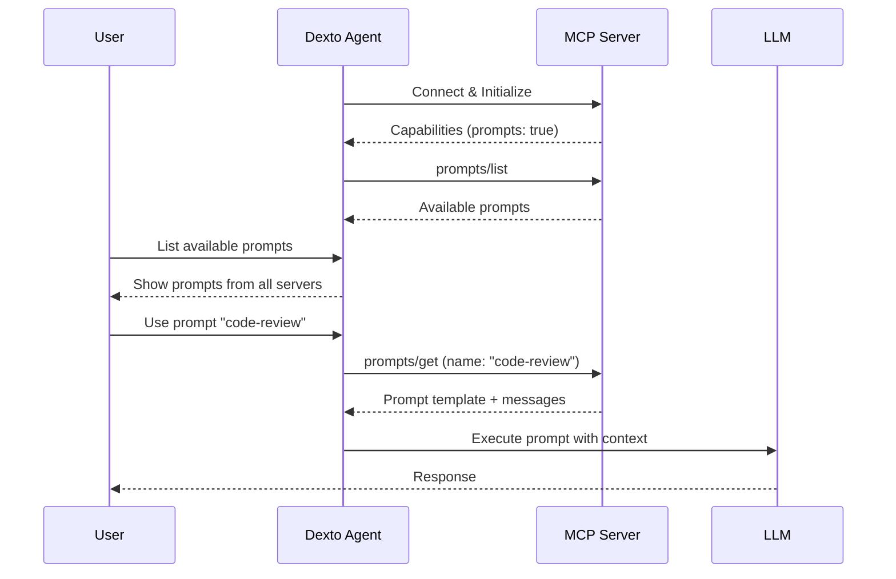

# MCP Prompts

MCP Prompts provide a standardized way for MCP servers to expose templated prompts and instructions to clients. Prompts allow servers to offer pre-configured, reusable interactions that users can easily discover and invoke.

:::tip Official Specification
This feature implements the [MCP Prompts Specification](https://spec.modelcontextprotocol.io/specification/2025-03-26/server/prompts/).
:::

## Overview

Prompts in the Model Context Protocol are user-controlled templates that servers expose to help users interact with LLMs more effectively. They provide structured messages, arguments, and instructions for common tasks.

**Key characteristics:**
- User-initiated (triggered explicitly by the user)
- Parameterized with arguments
- Discoverable through the client interface
- Can include embedded resources and rich content
- Support multiple content types (text, images, audio)

## How It Works

### Prompt Discovery Flow



### Prompt Execution

1. **Discovery** - User explores available prompts
2. **Selection** - User chooses a prompt (e.g., `/use code-review`)
3. **Arguments** - User provides required arguments
4. **Template Expansion** - Server fills in the prompt template
5. **Execution** - LLM processes the prompt with context
6. **Response** - User receives the result

## Configuration

Prompts are automatically discovered from MCP servers that support them:

```yaml
mcpServers:
  code-helper:
    type: stdio
    command: npx
    args: ["-y", "@modelcontextprotocol/server-code-helper"]
    # Prompts are auto-discovered if server supports them
```

No additional configuration is needed - Dexto automatically:
- Discovers prompts during server initialization
- Lists prompts when requested
- Executes prompts on user command
- Handles prompt updates if server supports notifications

## Using Prompts in CLI

### List Available Prompts

```bash
dexto
> /prompts
```

Output:
```
Available prompts from MCP servers:

code-helper:
  - code-review: Review code for best practices and issues
  - explain-code: Explain what a piece of code does
  - optimize: Suggest optimizations for code

docs-server:
  - summarize-doc: Summarize a documentation file
  - find-examples: Find code examples in documentation
```

### Use a Prompt

Execute a prompt directly:

```bash
> /use code-review file=src/app.ts
```

Or use the short form if the server supports it:

```bash
> /code-review src/app.ts
```

### Prompts with Arguments

Many prompts accept arguments:

```bash
> /use explain-code language=typescript file=utils.ts detail=high
```

Arguments can be:
- **Required** - Must be provided
- **Optional** - Have default values
- **Auto-completed** - Suggestions provided by server

## Using Prompts Programmatically

### List Prompts

```typescript
import { DextoAgent } from 'dexto';

const agent = new DextoAgent(config);
await agent.start();

// Get all MCP clients
const clients = agent.mcpManager.getClients();

// List prompts from each server
for (const [serverName, client] of clients.entries()) {
  const prompts = await client.listPrompts();

  console.log(`\nPrompts from ${serverName}:`);
  for (const prompt of prompts) {
    console.log(`  - ${prompt.name}: ${prompt.description}`);
    if (prompt.arguments && prompt.arguments.length > 0) {
      console.log(`    Arguments: ${prompt.arguments.map(a => a.name).join(', ')}`);
    }
  }
}
```

### Get and Execute a Prompt

```typescript
// Get a specific prompt with arguments
const serverName = 'code-helper';
const client = agent.mcpManager.getClient(serverName);

if (!client) {
  console.error(`Server ${serverName} not connected`);
  return;
}

const prompt = await client.getPrompt('code-review', {
  file: 'src/app.ts',
  focus: 'security'
});

// The prompt contains messages to send to the LLM
console.log('Prompt messages:', prompt.messages);

// Send to LLM
const response = await agent.sendMessage(
  prompt.messages.map(m => m.content).join('\n\n')
);

console.log('LLM Response:', response);
```

## Prompt Structure

### Prompt Metadata

```typescript
{
  name: string;              // Unique identifier
  description?: string;      // Human-readable description
  arguments?: Argument[];    // Optional arguments
}
```

### Argument Definition

```typescript
{
  name: string;              // Argument name
  description?: string;      // What this argument is for
  required?: boolean;        // Is it required?
}
```

### Prompt Result

When you get a prompt, the server returns:

```typescript
{
  description?: string;      // Optional description
  messages: Message[];       // Array of messages to send to LLM
}
```

### Message Content Types

Prompts can include various content types:

#### Text Content
```typescript
{
  type: "text",
  text: "Review this code for security issues..."
}
```

#### Image Content
```typescript
{
  type: "image",
  data: "base64-encoded-image-data",
  mimeType: "image/png"
}
```

#### Embedded Resources
```typescript
{
  type: "resource",
  resource: {
    uri: "file:///path/to/file.ts",
    text: "... file content ..."
  }
}
```

## Common Use Cases

### Code Review Prompts

```yaml
mcpServers:
  code-helper:
    type: stdio
    command: npx
    args: ["-y", "my-code-review-server"]
```

Example prompts:
- `code-review` - Review code for issues
- `security-audit` - Security-focused review
- `performance-check` - Performance optimization suggestions

### Documentation Prompts

```yaml
mcpServers:
  docs:
    type: stdio
    command: npx
    args: ["-y", "docs-prompt-server"]
```

Example prompts:
- `summarize` - Summarize documentation
- `find-examples` - Extract code examples
- `explain-concept` - Explain a specific concept

### Testing Prompts

```yaml
mcpServers:
  test-helper:
    type: stdio
    command: npx
    args: ["-y", "test-prompt-server"]
```

Example prompts:
- `generate-tests` - Create unit tests
- `review-coverage` - Analyze test coverage
- `suggest-cases` - Suggest additional test cases

## Best Practices

### For Users

1. **Explore available prompts** - Use `/prompts` to see what's available
2. **Use descriptive names** - Name your prompt invocations clearly
3. **Provide complete arguments** - Include all required parameters
4. **Combine with resources** - Prompts work great with resources for context

### For MCP Server Development

1. **Make prompts discoverable** - Clear names and descriptions
2. **Use meaningful arguments** - Well-named, documented parameters
3. **Provide defaults** - Optional arguments with sensible defaults
4. **Include examples** - Show how to use complex prompts
5. **Embed resources** - Use resource references for file content
6. **Support auto-completion** - Help users fill in arguments
7. **Handle missing arguments** - Graceful error messages

## Prompt Design Patterns

### Simple Command Pattern

Single-purpose prompt with no arguments:

```typescript
{
  name: "explain-project",
  description: "Explain the overall project structure"
}
```

### Parameterized Pattern

Prompt with customizable arguments:

```typescript
{
  name: "code-review",
  description: "Review code with specific focus",
  arguments: [
    { name: "file", required: true, description: "File to review" },
    { name: "focus", required: false, description: "Review focus area" }
  ]
}
```

### Resource-Embedded Pattern

Prompt that includes file contents:

```typescript
{
  name: "analyze-file",
  messages: [
    {
      role: "user",
      content: {
        type: "resource",
        resource: {
          uri: "file:///project/src/app.ts",
          text: "... file content ..."
        }
      }
    },
    {
      role: "user",
      content: {
        type: "text",
        text: "Analyze this code for potential improvements"
      }
    }
  ]
}
```

## Troubleshooting

### Prompts Not Appearing

**Check server capabilities:**
```bash
DEXTO_LOG_LEVEL=debug dexto

# Look for:
# "Server 'name' capabilities: { prompts: true }"
```

**Verify server configuration:**
- Server starts successfully
- Server declares prompts capability
- Use `/prompts` command to list

### Prompt Execution Fails

**Common issues:**

1. **Missing required arguments**
   ```bash
   # Error: Argument 'file' is required
   > /use code-review

   # Fix: Provide required argument
   > /use code-review file=app.ts
   ```

2. **Invalid argument values**
   - Check argument format
   - Verify files/paths exist
   - Ensure values match expected type

3. **Server error**
   - Check server logs
   - Verify server is connected
   - Ensure server has access to resources

### Prompt Returns Empty Response

**Possible causes:**
1. Prompt template is incomplete
2. Server failed to expand template
3. Arguments not properly substituted

**Solution:**
```bash
# Enable debug logging to see full prompt
DEXTO_LOG_LEVEL=debug dexto

# Look for "getPrompt response" messages
```

## See Also

- [MCP Overview](./overview) - Introduction to Model Context Protocol
- [MCP Resources](./resources) - Resources for context in prompts
- [Internal Tools](../guides/configuring-dexto/internalTools) - Built-in Dexto tools
- [Official MCP Prompts Spec](https://spec.modelcontextprotocol.io/specification/2025-03-26/server/prompts/)
