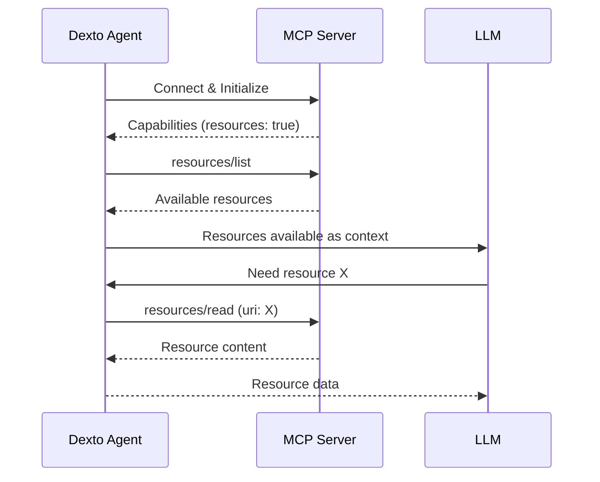

# MCP Resources

MCP Resources allow servers to expose data and context to LLMs through a standardized protocol. Resources provide a way for external MCP servers to share files, database schemas, application state, and other contextual information with your Dexto agent.

:::tip Official Specification
This feature implements the [MCP Resources Specification](https://spec.modelcontextprotocol.io/specification/2025-03-26/server/resources/).
:::

## Overview

Resources in the Model Context Protocol provide a standardized way for servers to expose data that provides context to language models. Unlike tools which perform actions, resources are passive data sources that the LLM can read when it needs additional context.

**Key characteristics:**
- Each resource has a unique URI identifier
- Resources are read-only from the client perspective
- Servers can provide metadata (name, description, MIME type)
- Supports real-time updates via notifications

## How It Works

### Resource Discovery

When your Dexto agent connects to MCP servers, it automatically discovers available resources:



### Resource Lifecycle

1. **Discovery** - Agent lists available resources from all connected servers
2. **Metadata** - LLM sees resource URIs, names, and descriptions
3. **On-Demand Reading** - LLM requests specific resources when needed
4. **Updates** - Servers can notify about resource changes (if supported)

## Configuration

Resources are automatically enabled when you connect to MCP servers. The server declares resource support during initialization:

```yaml
mcpServers:
  docs-server:
    type: stdio
    command: npx
    args: ["-y", "@modelcontextprotocol/server-docs"]
    # Resources are auto-discovered if server supports them
```

### Resource Notifications

Some servers support real-time resource updates:

```yaml
mcpServers:
  filesystem:
    type: stdio
    command: npx
    args: ["-y", "@modelcontextprotocol/server-filesystem", "./watched-dir"]
    # Server may send resourceUpdated notifications
```

Dexto automatically handles:
- `resources/listChanged` - Resource list has changed
- `resources/updated` - Specific resource content changed

## Resource URI Schemes

Resources are identified by URIs. Common schemes include:

### File System
```
file:///absolute/path/to/file.txt
file:///home/user/documents/notes.md
```

### HTTP/HTTPS
```
http://example.com/api/data
https://api.service.com/v1/schema
```

### Custom Schemes
```
git://repo/path/to/file
db://database/table/schema
app://workspace/project/config
```

The scheme determines how the server retrieves the resource content.

## Using Resources

### From LLM Perspective

The LLM sees resources as available context sources:

```
Available resources:
  - file:///project/README.md (Project documentation)
  - file:///project/src/config.ts (Configuration file)
  - db://main/users/schema (Database schema)
```

When the LLM needs context, it can request:
```
Read resource: file:///project/README.md
```

### Listing Resources Programmatically

Using the Dexto SDK:

```typescript
import { DextoAgent } from 'dexto';

const agent = new DextoAgent(config);
await agent.start();

// List all resources from all MCP servers
const resources = await agent.resourceManager.list();

for (const [uri, metadata] of Object.entries(resources)) {
  console.log(`${metadata.name}: ${uri}`);
  console.log(`  Description: ${metadata.description}`);
  console.log(`  Source: ${metadata.source}`);
  console.log(`  Server: ${metadata.serverName || 'N/A'}`);
}
```

### Reading Resources

```typescript
// Read a specific resource
const content = await agent.resourceManager.read('file:///project/README.md');

console.log('Content:', content.contents);
console.log('MIME Type:', content.mimeType);
```

## Common MCP Servers with Resources

### Filesystem Server

Exposes local files and directories:

```yaml
mcpServers:
  filesystem:
    type: stdio
    command: npx
    args: ["-y", "@modelcontextprotocol/server-filesystem", "./project-root"]
```

**Resources provided:**
- All files in specified directory
- URIs: `file:///absolute/paths`
- Supports subdirectories

### GitHub Server

Exposes GitHub repository contents:

```yaml
mcpServers:
  github:
    type: stdio
    command: npx
    args: ["-y", "@modelcontextprotocol/server-github"]
    env:
      GITHUB_TOKEN: $GITHUB_TOKEN
```

**Resources provided:**
- Repository files
- Issues and pull requests
- README and documentation
- URIs: Custom GitHub scheme

### Documentation Servers

Many documentation servers expose their content as resources, making it easy for LLMs to access product docs, API references, and guides.

## Resource Metadata

Each resource includes metadata:

```typescript
{
  uri: string;           // Unique identifier
  name: string;          // Human-readable name
  description?: string;  // Optional description
  mimeType?: string;     // Optional MIME type
  source: "mcp";         // Always "mcp" for MCP resources
  serverName: string;    // Which MCP server provides this
  metadata: {
    originalUri: string; // Original URI from server
    serverName: string;
  }
}
```

## Resource vs Internal Resources

Dexto supports two types of resources:

| Feature | MCP Resources | Internal Resources |
|---------|---------------|-------------------|
| **Source** | External MCP servers | Dexto agent itself |
| **Setup** | Requires MCP server | Configure in agent.yml |
| **Types** | Server-defined | Filesystem, Blob |
| **Updates** | Server notifications | Agent-managed |
| **Use Case** | External data sources | Local project files |

See [Internal Resources](../guides/configuring-dexto/internalResources) for agent-managed resources.

## Real-Time Updates

If a server supports resource notifications, Dexto automatically handles them:

### List Changed
Server notifies when the list of available resources changes (resources added/removed):

```typescript
// Automatically handled by Dexto
// No configuration needed
```

### Resource Updated
Server notifies when a specific resource's content changes:

```typescript
// Dexto emits events you can listen to
agent.on('resource:updated', (event) => {
  console.log(`Resource updated: ${event.uri}`);
  // Optionally refresh resource
});
```

## Best Practices

### For Agent Configuration

1. **Use specific paths** - Don't expose entire filesystems
   ```yaml
   # Good
   args: ["-y", "@modelcontextprotocol/server-filesystem", "./docs"]

   # Bad
   args: ["-y", "@modelcontextprotocol/server-filesystem", "/"]
   ```

2. **Provide context** - Use resources for documentation, schemas, examples
3. **Combine with tools** - Resources provide context, tools take actions
4. **Monitor resource count** - Too many resources can overwhelm the LLM

### For MCP Server Development

1. **Use descriptive names** - Help LLMs understand what each resource contains
2. **Add descriptions** - Explain when and why to use each resource
3. **Set appropriate MIME types** - Helps LLMs understand content format
4. **Implement notifications** - For dynamic resources that change frequently
5. **Handle errors gracefully** - Resources may be temporarily unavailable

## Troubleshooting

### Resources Not Appearing

**Check server capabilities:**
```bash
# Enable debug logging
DEXTO_LOG_LEVEL=debug dexto

# Look for messages like:
# "Server 'name' capabilities: { resources: true }"
```

**Verify server configuration:**
- Server command is correct
- Server starts without errors
- Server declares resource capability

### Reading Resources Fails

**Common issues:**
1. **Invalid URI** - Check URI format matches server's scheme
2. **Permissions** - Server may lack access to resource
3. **Resource moved/deleted** - Resource no longer exists
4. **Timeout** - Large resources may exceed timeout

**Solution:**
```yaml
mcpServers:
  my-server:
    type: stdio
    command: server-cmd
    timeout: 60000  # Increase timeout for large resources
```

### Too Many Resources

If servers expose too many resources:

1. **Filter at server level** - Configure server to expose fewer resources
2. **Use multiple specific servers** - Instead of one broad server
3. **Increase limits** - If legitimately needed
4. **Check for duplicates** - Multiple servers may expose same resources

## See Also

- [MCP Overview](./overview) - Introduction to Model Context Protocol
- [MCP Prompts](./prompts) - Templated prompts from MCP servers
- [Internal Resources](../guides/configuring-dexto/internalResources) - Agent-managed resources
- [Official MCP Resources Spec](https://spec.modelcontextprotocol.io/specification/2025-03-26/server/resources/)
