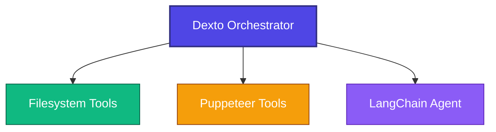

# Integrating Existing Agents: Dexto + LangChain

This tutorial shows you how to integrate an existing LangChain agent with Dexto to create a multi-agent system. Instead of rebuilding your agent, you'll learn to wrap it with MCP and let Dexto orchestrate between it and other tools.

## The Integration Pattern

Here's what we're building - a single system where Dexto coordinates between different tools:



Your existing LangChain agent becomes just another tool in Dexto's toolkit, working alongside file operations and web browsing.

## How the Integration Works

The integration happens in three simple steps. Let's walk through each piece of code to see exactly what's happening.

### Step 1: Your Existing LangChain Agent

Here's a typical LangChain agent you might already have:

```javascript
// agent.js
import { ChatOpenAI } from '@langchain/openai';
import { PromptTemplate } from '@langchain/core/prompts';

class LangChainAgent {
    constructor() {
        this.llm = new ChatOpenAI({ model: 'gpt-4o-mini' });
        this.tools = {
            summarize: this.summarize.bind(this),
            translate: this.translate.bind(this),
            analyze: this.analyze.bind(this)
        };
    }

    async run(input) {
        const prompt = PromptTemplate.fromTemplate(`
            You have three tools: summarize, translate, analyze.
            User input: {user_input}
            Determine which tool to use and provide a helpful response.
        `);
        
        const chain = prompt.pipe(this.llm);
        const result = await chain.invoke({ user_input: input });
        return result.content;
    }
}
```

This is your standard LangChain agent - it stays exactly as it is. No modifications needed.

### Step 2: Wrap It in MCP

Now we create a thin MCP wrapper that exposes your agent:

```javascript
// mcp-server.js
import { McpServer } from '@modelcontextprotocol/sdk/server/mcp.js';
import { z } from 'zod';
import { LangChainAgent } from './agent.js';

class LangChainMCPServer {
    constructor() {
        this.server = new McpServer({ name: 'langchain-agent', version: '1.0.0' });
        this.agent = new LangChainAgent();
        this.registerTools();
    }

    registerTools() {
        this.server.registerTool(
            'chat_with_langchain_agent',
            {
                description: 'Chat with a LangChain agent for text processing',
                inputSchema: {
                    message: z.string().describe('Message to send to the agent')
                }
            },
            async ({ message }) => {
                const response = await this.agent.run(message);
                return { content: [{ type: 'text', text: response }] };
            }
        );
    }
}
```

This wrapper does one thing: it takes MCP tool calls and forwards them to your existing agent.

### Step 3: Configure Dexto

Finally, tell Dexto about all your tools in the configuration:

```yaml
# dexto-agent-with-langchain.yml
mcpServers:
  filesystem:
    type: stdio
    command: npx
    args: ["-y", "@modelcontextprotocol/server-filesystem", "."]
    
  playwright:
    type: stdio
    command: npx
    args:
      - "-y"
      - "@playwright/mcp@latest"
    
  langchain:
    type: stdio
    command: node
    args: ["./langchain-agent/dist/mcp-server.js"]
    env:
      OPENAI_API_KEY: $OPENAI_API_KEY
```

Now Dexto can coordinate between file operations, web browsing, and your LangChain agent.

## See It in Action

```bash
# Setup
cd examples/dexto-langchain-integration/langchain-agent && npm install && npm run build
export OPENAI_API_KEY="your_key_here"
cd ../../../  # Return to repo root

# Run a multi-agent workflow
dexto --agent ./examples/dexto-langchain-integration/dexto-agent-with-langchain.yml "Read README.md, analyze its sentiment, and save the analysis"
```

What happens when you run this:

1. **Dexto receives** the natural language request
2. **Breaks it down** into subtasks: read file → analyze sentiment → save result
3. **Routes each task** to the appropriate tool:
   - File reading → filesystem MCP server
   - Sentiment analysis → LangChain MCP server  
   - File saving → filesystem MCP server
4. **Coordinates the workflow** and returns the final result

## Extending the Pattern

Want to add more agents? Just follow the same three-step pattern:

```yaml
mcpServers:
  # Your existing setup
  langchain:
    type: stdio
    command: node
    args: ["./langchain-agent/dist/mcp-server.js"]
    
  # Add more agents
  autogen-research:
    type: stdio
    command: python
    args: ["./autogen-agent/mcp_server.py"]
    
  custom-analyzer:
    type: stdio
    command: "./custom-agent/target/release/mcp-server"
```

Each agent runs independently, but Dexto can orchestrate between all of them based on the task at hand.

## Benefits of using Dexto

Instead of building custom orchestration logic, Dexto gives you:

- **Intelligent routing**: Automatically determines which tools to use and in what order
- **State management**: Shares context and results between different systems seamlessly  
- **Workflow coordination**: Handles dependencies, retries, and error handling across steps
- **Natural language interface**: Describe complex multi-step workflows in plain English

Without Dexto, you'd manually chain API calls and manage coordination between your LangChain agent, file operations, and web browsing. With Dexto, you just describe what you want.

## Key Takeaways

- **Your existing agents don't change** - they keep working exactly as before
- **MCP provides the bridge** - a simple wrapper makes any agent Dexto-compatible
- **Dexto handles orchestration** - it figures out which tool to use when
- **The pattern scales** - add as many agents and frameworks as you need

This approach lets you build sophisticated multi-agent systems by composing existing pieces, rather than rebuilding everything from scratch.