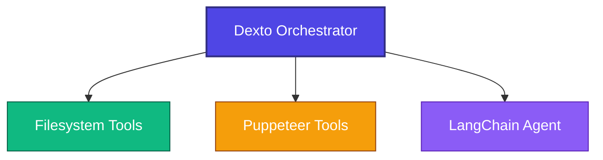

# Dexto + LangChain Example

This example demonstrates how Dexto's orchestration layer can integrate existing agents from other frameworks (like LangChain, LangGraph, etc.) via the Model Context Protocol (MCP), enabling seamless multi-agent workflows.

## Architecture



## How to Think About Multi-Agent Integration

When building multi-agent systems, you often have agents built in different frameworks. Here's how to approach this with Dexto:

1. **Start with what you have**: You may already have agents in LangChain, LangGraph, AutoGen, or other frameworks
2. **Use MCP as the bridge**: Instead of rebuilding or creating custom adapters, wrap your existing agents with MCP as a tool
3. **Let Dexto orchestrate**: Dexto can then coordinate between your existing agents and other tools/subsystems
4. **Build incrementally**: Add more agents and frameworks as needed - MCP makes it straightforward

## Quick Setup

```bash
# Install dependencies
cd examples/dexto-langchain-integration/langchain-agent
npm install
npm run build

# Set API key
export OPENAI_API_KEY="your_openai_api_key_here"

# Test integration (run from repository root)
cd ../../..
dexto --agent ./examples/dexto-langchain-integration/dexto-agent-with-langchain.yml "Analyze the sentiment of this review: 'I absolutely love this product! The quality is amazing and the customer service was outstanding. Best purchase I've made this year.'"

# Note: Agent file paths in the YAML config are resolved relative to the current working directory
```

## What You Can Do

**Dexto orchestrates between:**
- **Filesystem**: Read/write files
- **Puppeteer**: Web browsing and interaction
- **LangChain Agent**: Text summarization, translation, sentiment analysis

**Example workflows:**
```bash
# Text summarization
dexto --agent ./examples/dexto-langchain-integration/dexto-agent-with-langchain.yml "Summarize this article: Artificial intelligence has transformed how we work, with tools like ChatGPT and GitHub Copilot becoming essential for developers. These AI assistants help write code, debug issues, and even design entire applications. The impact extends beyond coding - AI is reshaping customer service, content creation, and decision-making processes across industries."

# Translation
dexto --agent ./examples/dexto-langchain-integration/dexto-agent-with-langchain.yml "Translate this text to Spanish: The weather is beautiful today and I'm going to the park to enjoy the sunshine."

# Sentiment Analysis
dexto --agent ./examples/dexto-langchain-integration/dexto-agent-with-langchain.yml "Analyze the sentiment of this customer review: 'I absolutely love this product! The quality is amazing and the customer service was outstanding. Best purchase I've made this year.'"

# Multi-step: Read file → Summarize → Save
dexto --agent ./examples/dexto-langchain-integration/dexto-agent-with-langchain.yml "Read README.md, summarize it, save the summary"

# Complex: Web scrape → Sentiment Analysis → Save
dexto --agent ./examples/dexto-langchain-integration/dexto-agent-with-langchain.yml "Search for customer reviews about our product, analyze the sentiment, save as sentiment_report.md"
```

## How It Works

1. **Dexto Orchestrator**: Manages & supervises all subsystems and workflows
2. **LangChain MCP Agent**: Wraps existing LangChain agent as a Dexto subsystem
3. **Configuration**: Registers LangChain alongside filesystem and puppeteer tools

## Extending

**Add agents from other frameworks:**
1. Wrap more agents into an MCP Server
2. Add to Dexto configuration
3. Dexto orchestrates between all agents and subsystems

**Add capabilities to existing agents:**
1. Extend your external agent capabilities
2. Register new tools/methods
3. Dexto accesses via MCP integration

This demonstrates how to think about Dexto as your orchestration layer for multi-agent systems - start with your existing agents, use MCP to connect them, and let Dexto handle the coordination.
