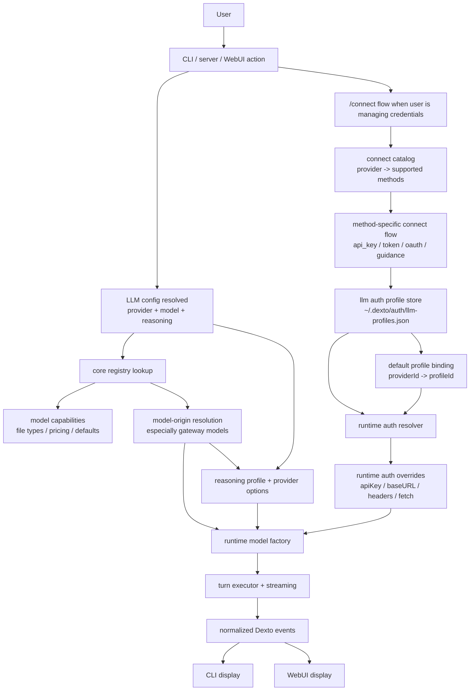
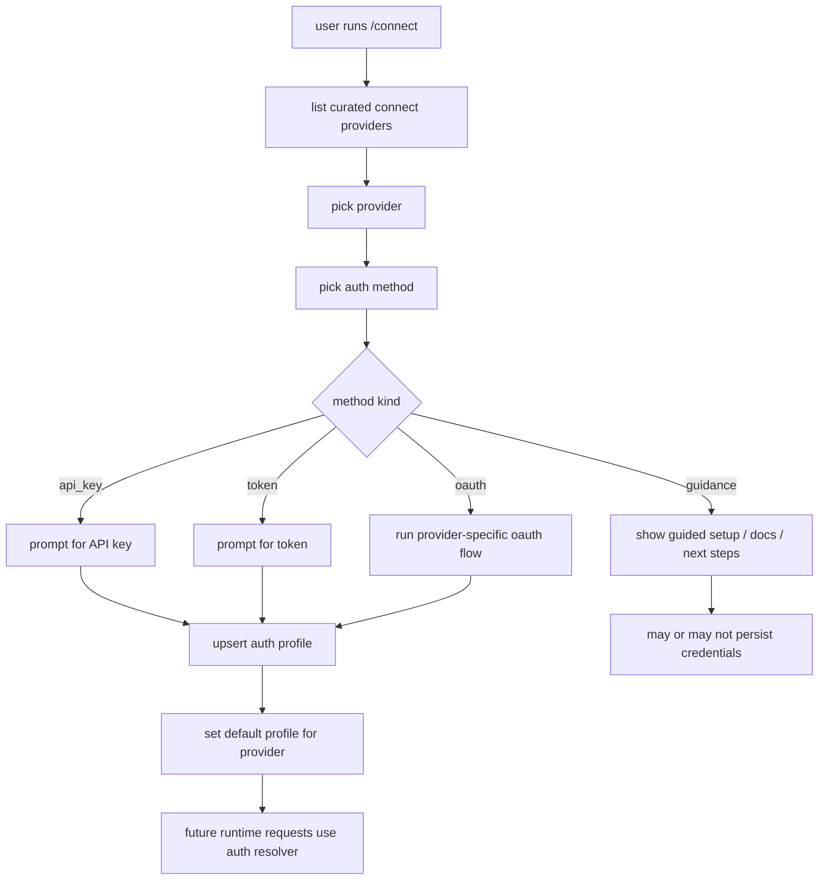
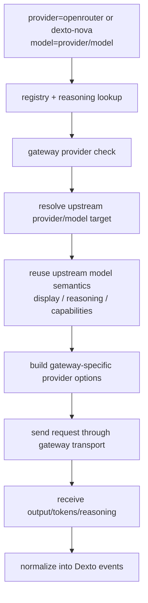
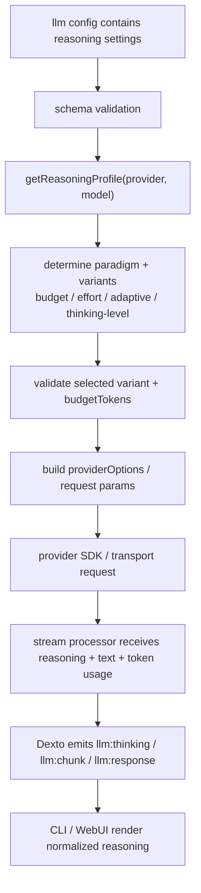
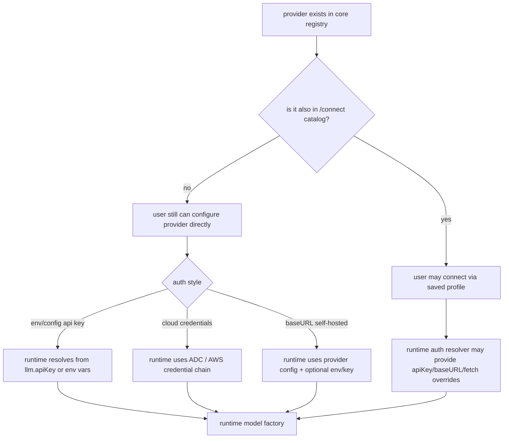
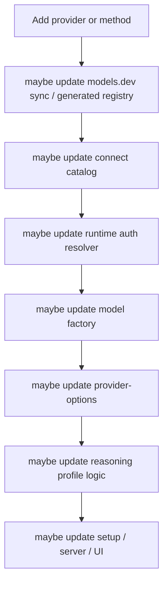
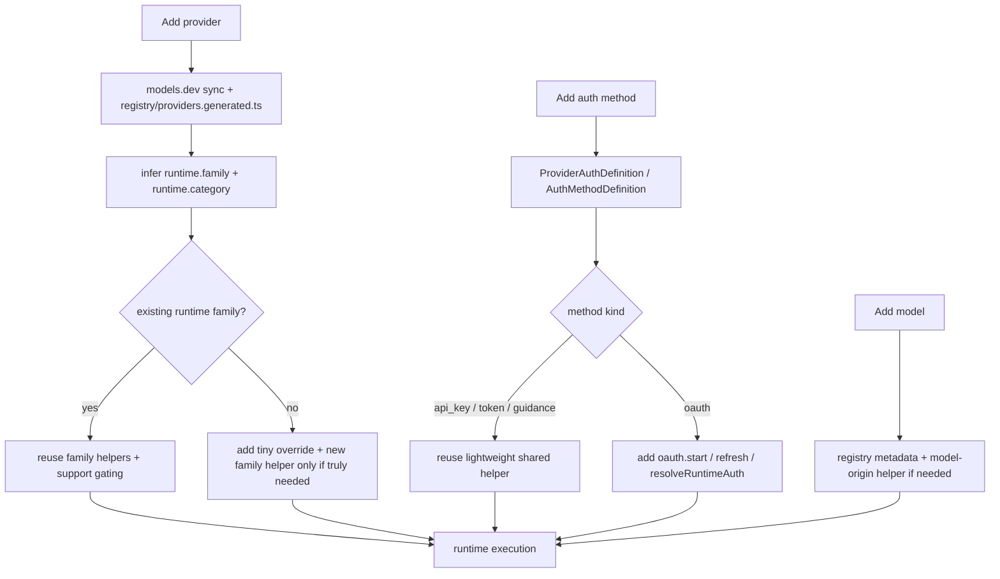

# Architecture Flow - Provider Connect, Runtime Auth, and Reasoning

Date: **2026-04-02**

This note explains the current end-to-end flow in Dexto and the finalized v2 refactor shape.
It is intentionally focused on:

- how `/connect` fits into the system
- how runtime auth is applied
- how gateway providers like `openrouter` and `dexto-nova` fit in
- how reasoning flows through the system
- how new providers, methods, and models get added

Related notes:

- [`PLAN.md`](./PLAN.md)
- [`UPDATED_DIRECTION.md`](../UPDATED_DIRECTION.md)

---

## 1. High-Level Mental Model

There are 4 different concerns that are easy to mix together:

1. Provider identity
   - What the user selects in config, setup, `/connect`, model picker, and APIs.
   - Examples: `openai`, `anthropic`, `openrouter`, `dexto-nova`, `google-vertex`.

2. Auth method
   - How credentials are acquired and stored.
   - Examples: API key, setup token, OAuth device flow, guided non-secret setup.

3. Runtime transport/API family
   - How requests are actually sent.
   - Examples: OpenAI Responses, Anthropic Messages, Google GenAI, Bedrock, OpenRouter gateway.

4. Model semantics
   - The model-specific behavior that affects capabilities and reasoning controls.
   - Examples:
     - old Anthropic reasoning models are budget-based
     - newer Claude 4.6 family uses adaptive effort
     - Gemini 2.5 vs Gemini 3 use different reasoning paradigms
     - gateway model IDs may need mapping back to upstream model names

The current code already has pieces of all 4, but they are distributed across different modules.

---

## 2. Current End-to-End Runtime Flow

### Current runtime ownership by subsystem

- `agent-management`
  - owns auth profile persistence
  - owns `/connect` provider/method catalog
  - owns runtime auth resolver implementation

- `core`
  - owns provider/model registry and capabilities
  - owns reasoning profile logic
  - owns runtime model construction
  - owns turn execution and event streaming

- `server`
  - exposes `/llm/catalog`, `/llm/capabilities`, `/llm/connect/*`

- `cli`
  - owns interactive `/connect` UX

---

## 3. Where `/connect` Fits

`/connect` is not the source of truth for all providers Dexto can run.

It is the source of truth for the providers/methods that Dexto currently offers as a first-class credential-management UX.

That means there are two overlapping but different surfaces:

- Provider registry
  - "What providers/models Dexto understands and can run"

- `/connect` catalog
  - "What providers currently have a curated auth flow in Dexto"

### Current `/connect` flow

### Important implication

A provider can be:

- in the registry but not in `/connect`
- in `/connect` and in the registry
- in the registry with env/cloud-credential-only setup and no `/connect` method

### Phase 1 auth persistence simplification

The finalized plan keeps auth persistence intentionally simple:

- method-specific extras stay in `credential.metadata`
- phase 1 does **not** introduce typed per-method persisted auth schemas
- the main change is consolidating behavior ownership, not redesigning the stored profile model

---

## 4. Current Gateway Flow

Gateway providers are the trickiest part because they combine:

- one provider identity selected by the user
- many possible upstream model families
- gateway-specific request wire formats
- upstream-specific model semantics

Today, `openrouter` and `dexto-nova` already do some real model-origin resolution.

### Current gateway capability and reasoning flow

### What already works today

- gateway model IDs are required to be in OpenRouter-style `provider/model` format
- gateway capability and reasoning lookups already reuse upstream semantics for supported families
- some naming mismatches are already handled
  - Anthropic native IDs vs OpenRouter dotted IDs
  - Gemini variants with optional `-001`

### What is still awkward

- origin resolution lives in registry/reasoning helpers
- request translation lives elsewhere
- exclusions/allowlists still exist for unsupported or unstable gateway families

So the current issue is not "gateways are naive." The issue is "gateway knowledge is spread out."

---

## 5. Current Reasoning Flow

Reasoning has 3 distinct parts.

1. Capability semantics
   - What reasoning controls the model supports.

2. Request translation
   - How Dexto translates those controls into provider-specific wire format.

3. Output normalization
   - How provider-native reasoning output becomes Dexto events/UI state.
   - In the current codebase, this is already centered on `executor/stream-processor.ts`.

### Current reasoning control flow

### Important nuance

The hard part is mostly the control plane, not the display plane.

Examples of real model-family variation that belongs somewhere explicit:

- older Anthropic reasoning models:
  - budget-based thinking
- newer Claude 4.6 family:
  - adaptive effort
- OpenAI reasoning:
  - effort ladder
- Gemini:
  - `thinkingConfig` with different paradigms across generations
- Bedrock:
  - different semantics for Anthropic-backed and Nova-backed models

The display/output side should be much more standardized than the control side.

---

## 6. Unknown Reasoning Semantics

One important nuance from the current code:

- Dexto is already intentionally strict when it does not understand a model's reasoning semantics.
- It generally does **not** guess.

### Current fallback shape

For gateway models like `openrouter` / `dexto-nova`:

- `reasoning/profiles/openrouter.ts`
  - tries to map the gateway model to an upstream family we understand
- if that fails
  - `reasoning/profile.ts` returns `nonCapableProfile()`
- then
  - `executor/provider-options.ts` sends no explicit reasoning controls

So today, the safe fallback is effectively:

- still run the model
- do not guess reasoning parameters
- treat reasoning controls as unavailable

### Proposed refinement

The future shape should make a clearer distinction between:

- known supported
- known unsupported
- unknown semantics

That would let UI/runtime say:

- "this model does not support Dexto reasoning controls"
- versus
- "this model may support reasoning, but Dexto does not know the semantics well enough to expose controls"

---

## 7. How Providers In Registry But Not In `/connect` Work

### What these providers are for

Providers that are in the registry but not in `/connect` still matter for:

- validating config
- allowing direct config references
- model picker and capability endpoints
- file support checks
- pricing
- reasoning support and defaults
- runtime execution

### Typical behavior by category

- Direct key/env providers
  - e.g. `groq`, `xai`, `cohere`, many others
  - usually work via config `apiKey` or env vars today

- Cloud auth providers
  - e.g. `google-vertex`, `google-vertex-anthropic`, `amazon-bedrock`
  - usually do not rely on `/connect`
  - runtime uses ADC / AWS credentials instead

- Self-hosted or open-ended transports
  - e.g. `openai-compatible`, `litellm`
  - may require `baseURL`
  - may accept arbitrary model IDs

- Gateway providers
  - e.g. `openrouter`, `dexto-nova`
  - may allow large model surfaces
  - often need model-origin resolution

---

## 8. How New Things Get Added Today vs Final Shape

### Today

This is why the current shape feels branch-heavy.

### Final phase 1 shape

### What changed from the earlier draft

- Provider identity stays centered on the registry / `ProviderInfo` surface, not a new `ProviderDefinition` registry in phase 1.
- Runtime behavior is localized mainly through `runtime.family` plus small family helpers, not through a generic `ApiFamilyRuntime` abstraction.
- Auth stays provider-grouped and explicit, with OAuth-specific nested hooks only where OAuth actually needs them.
- These docs should not be read as requiring one file per runtime family or a package-wide move/rename program in phase 1.
- Method-specific auth extras remain in `credential.metadata`; there is no typed per-method storage redesign in phase 1.

---

## 9. Concrete Takeaways

- `/connect` should be thought of as a curated auth surface, not the universal provider registry.
- Gateway reasoning already partially reuses upstream model semantics; this is worth preserving.
- `StreamProcessor` already exists as the shared event/output boundary; we should build on it rather than inventing a parallel normalization layer.
- The finalized phase 1 shape keeps provider identity in the registry and adds Dexto-owned `runtime.family` / `runtime.category` metadata there.
- The main refactor need is to separate:
  - provider identity
  - auth method
  - API family
  - model semantics
- The best future shape is not "remove all branches."
- The best future shape is "keep the branches, but localize them to the right module."
