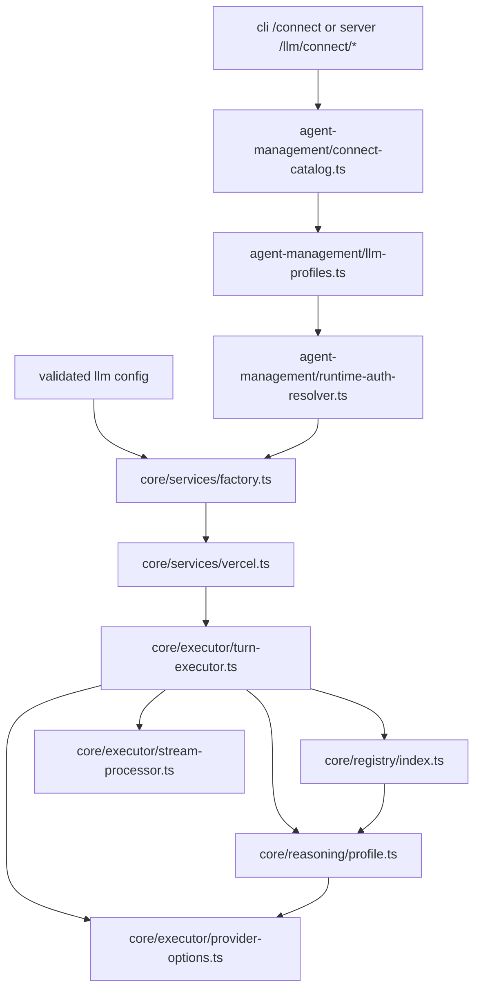
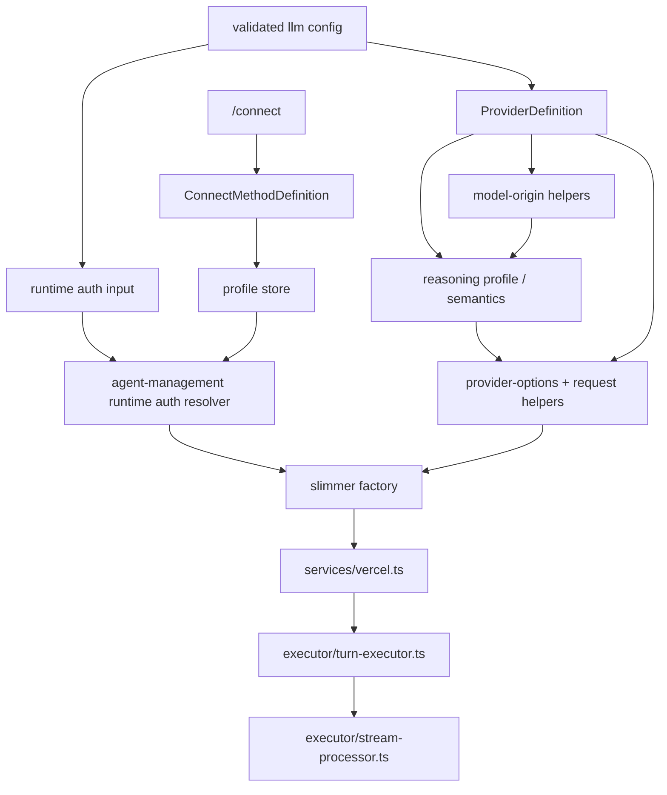
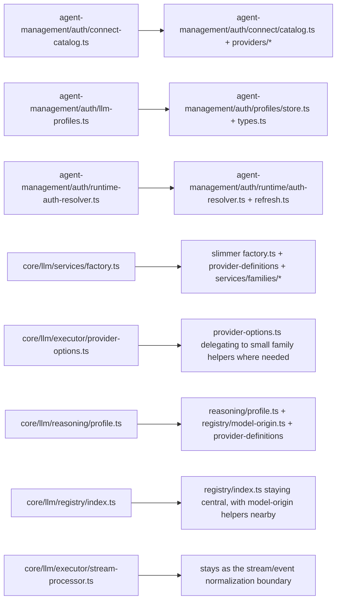
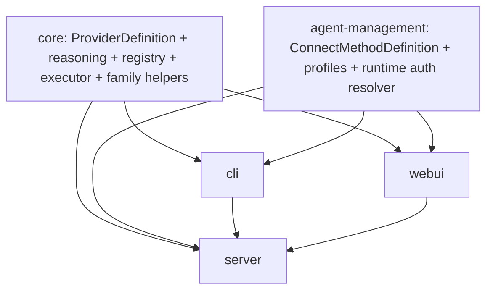

# Proposed Module Tree - Current Layout and V2 Refactor

Date: **2026-04-02**

This note updates the earlier writeup after re-reading the actual `packages/core/src/llm` layout.
The goal is to make it obvious:

- what structure already exists today
- what should stay as-is
- what should be split differently
- what belongs in `core` versus `agent-management`

---

## 1. Ownership Summary

### `packages/core`

Owns execution-time truth:

- provider identity used by configs and model execution
- model registry and model-origin resolution
- transport/API-kind registry
- reasoning semantics and request translation contracts
- stream normalization contracts
- runtime model factory and executor integration

### `packages/agent-management`

Owns user-managed credential state:

- credential/profile persistence
- connect catalog and method definitions
- auth flows that acquire credentials
- refresh logic and runtime auth resolution
- default-profile selection

### `packages/cli`

Owns terminal UX:

- interactive `/connect`
- presentation of provider/method lists
- prompts, browser/device-code flow UX, and feedback

### `packages/server`

Owns API exposure:

- `/llm/connect/*`
- `/llm/catalog`
- `/llm/capabilities`
- future inspection endpoints if we want to expose transport/auth metadata

### `packages/webui`

Owns browser UX only:

- connect screens and modals
- model picker UI
- settings surfaces

---

## 2. Current Layout Today

There is already a real architecture here. The problem is not "there is no structure."
The problem is "provider identity, auth method, API family, and model semantics are partially mixed together."

### Current core layout

```text
packages/core/src/llm/
  auth/
    types.ts

  executor/
    provider-options.ts
    stream-processor.ts
    tool-output-truncator.ts
    turn-executor.ts
    types.ts

  formatters/
    vercel.ts

  providers/
    codex-app-server.ts
    codex-base-url.ts
    openrouter-model-registry.ts
    local/
      ...

  reasoning/
    profile.ts
    profiles/
      anthropic.ts
      bedrock.ts
      google.ts
      openai.ts
      openai-compatible.ts
      openrouter.ts
      shared.ts
      vertex.ts
    anthropic-betas.ts
    anthropic-thinking.ts
    openai-reasoning-effort.ts

  registry/
    index.ts
    models.generated.ts
    models.manual.ts
    sync.ts
    auto-update.ts

  services/
    factory.ts
    vercel.ts
    index.ts

  curation.ts
  resolver.ts
  schemas.ts
  types.ts
  validation.ts
```

### Current auth/connect layout

```text
packages/agent-management/src/auth/
  connect-catalog.ts
  llm-profiles.ts
  runtime-auth-resolver.ts
```

### Current runtime control flow



### What this current structure already gets right

- `StreamProcessor` is already the normalization and persistence boundary.
- `TurnExecutor` is already the orchestration loop.
- `registry/` already owns a lot of capability truth.
- `reasoning/` already has real family-specific logic.
- `agent-management` already owns credential storage and runtime auth resolution.

### What is still mixed together

- `services/factory.ts`
  - mixes provider identity, API-family selection, endpoint presets, and some auth-dependent behavior
- `executor/provider-options.ts`
  - mixes provider IDs with API-family reasoning translation
- `reasoning/profile.ts`
  - mixes native providers and gateway-origin inference
- unknown reasoning semantics
  - often collapse into the same shape as known "not supported"

---

## 3. Main Pieces

### `ProviderDefinition` in `core`

This is the execution-facing definition of a provider.

It answers:

- what provider ID does config use?
- is this direct, gateway, cloud, or self-hosted?
- which API family does it run through?
- how should model-origin resolution work?

### `ConnectMethodDefinition` in `agent-management`

This is the user-facing auth/connect definition.

It answers:

- what methods can the user choose in `/connect`?
- what credential shape is stored?
- how is it refreshed?
- how does it project into runtime auth overrides?

### API-family mapping and helpers in `core`

This is a responsibility, not necessarily a large abstraction.

Examples:

- OpenAI Responses family
- Anthropic Messages family
- Google GenAI family
- Bedrock family
- OpenRouter gateway family

It answers:

- how do we build the SDK/client?
- how do we translate reasoning controls for this family?
- what family-specific request rules exist?

At first, this can stay as helper modules or functions used by:

- `services/factory.ts`
- `executor/provider-options.ts`

### model-origin helpers in `core`

This is also a responsibility first, not a required class.

It answers:

- for a gateway or proxy model ID, what upstream family/model semantics should we borrow?

Examples:

- `openrouter` or `dexto-nova` model -> upstream Anthropic/OpenAI/Google family
- future self-hosted or compatibility endpoints that need semantic mapping

---

## 4. Proposed V2 Shape

This is not a one-shot move. It is the target shape to grow toward.

### Proposed control flow



### Proposed file layout

```text
packages/
  core/
    src/
      llm/
        provider-definitions/
          index.ts
          types.ts
          builtins/
            openai.ts
            anthropic.ts
            google.ts
            google-vertex.ts
            google-vertex-anthropic.ts
            amazon-bedrock.ts
            openrouter.ts
            dexto-nova.ts
            openai-compatible.ts
            litellm.ts

        reasoning/
          profile.ts
          profiles/
            ...
          status.ts

        registry/
          index.ts
          models.generated.ts
          models.manual.ts
          providers.generated.ts
          sync.ts
          auto-update.ts
          model-origin.ts

        executor/
          provider-options.ts
          stream-processor.ts
          turn-executor.ts
          types.ts

        services/
          factory.ts
          vercel.ts
          index.ts
          families/
            openai.ts
            anthropic.ts
            google.ts
            bedrock.ts
            openrouter.ts

        auth/
          types.ts

  agent-management/
    src/
      auth/
        profiles/
          store.ts
          types.ts
        connect/
          catalog.ts
          types.ts
          providers/
            openai.ts
            anthropic.ts
            minimax.ts
            openrouter.ts
            vertex.ts
            bedrock.ts
          methods/
            api-key.ts
            oauth.ts
            setup-token.ts
            guidance.ts
        runtime/
          auth-resolver.ts
          refresh.ts
          types.ts
```

### Current -> proposed mapping



---

## 5. What Each V2 Abstraction Actually Owns

### `ProviderDefinition` in `core`

Owns:

- provider ID and label
- category: direct / gateway / self-hosted / cloud
- base URL expectations
- API-family selection
- model-origin rules when needed
- provider-level capability quirks

Should not own:

- OAuth browser logic
- profile persistence
- prompt UX

### `ConnectMethodDefinition` in `agent-management`

Owns:

- method ID and label
- credential schema
- acquisition flow
- refresh support
- redaction rules
- how saved credentials become `LlmRuntimeAuthOverrides`

Should not own:

- reasoning semantics
- model registry
- low-level execution

### API-family helpers in `core`

Own:

- SDK/client construction rules for one request family
- request-shape translation
- family-specific reasoning option translation
- family-level request quirks

Should stay small and local:

- plain functions or small modules are enough at first
- only grow into a heavier abstraction if the helper surface becomes large and stable

### model-origin helpers in `core`

Own:

- mapping gateway/proxy model IDs to upstream semantic families
- stripping or normalizing model IDs when the registry needs it
- giving reasoning/capability code a safer target model/provider when one exists

Should stay simple:

- start as stateless functions in `registry/model-origin.ts`
- do not introduce a class unless we eventually need multiple implementations, shared state, or explicit dependency injection

---

## 6. Why There Is No New `StreamNormalizer`

After reading the current code, I do not think we need a new abstraction here.

`executor/stream-processor.ts` already does the important work:

- consumes streamed events from the SDK
- accumulates assistant text
- accumulates reasoning deltas
- emits normalized Dexto events
- persists tool calls/results and usage data

So the right framing is:

- keep `StreamProcessor`
- let API-family modules shape request behavior
- keep stream/event normalization centralized unless a concrete family proves it cannot fit

In other words:

- small API-family helpers handle request-time translation
- `StreamProcessor` remains the shared response/event boundary

That is much closer to the current architecture.

---

## 7. Why There Is No Generic `Edge Hook`

The earlier "edge hook" wording was too vague.

I do not think we should introduce a generic hook abstraction yet.

The real exceptions already have narrower homes:

- auth-dependent URL/header rewriting
  - belongs in runtime auth resolution or its fetch wrapper
  - example: Codex-style OAuth request rewriting
- provider identity quirks
  - belong in `ProviderDefinition` or registry/model-origin helpers
- API-family request quirks
  - belong in family helper modules near `services/` or `executor/`

So the better rule is:

- do not invent a plugin seam just because some cases are awkward
- first try to place each awkward case in the narrowest existing layer

If, later, a truly cross-cutting exception appears, we can add a narrow helper then.
I would not design around it up front.

---

## 8. Unknown Or Unsupported Reasoning Semantics

This is an important distinction and the current code is stricter than the earlier writeup implied.

### Current behavior

Today, when Dexto cannot confidently determine reasoning semantics, it usually falls back to:

- `nonCapableProfile()`
- no explicit reasoning options sent

Example:

- `reasoning/profiles/openrouter.ts`
  - `getOpenRouterReasoningTarget()` returns `null` for families we do not allowlist or do not understand
- `reasoning/profile.ts`
  - maps that to `nonCapableProfile()`

That means "unknown" and "known unsupported" are too close together today.

### Better V2 behavior

I think the profile/result should explicitly separate:

- `supported`
  - we know the semantics and can surface controls
- `unsupported`
  - we know this model/family does not expose Dexto-usable reasoning controls
- `unknown`
  - the model can still run, but Dexto should not guess reasoning controls

### Safe fallback for unknown models

For things like a random OpenRouter model with unclear semantics:

- let the model run
- do not send guessed reasoning params
- do not offer false precision in the UI
- still accept streamed reasoning output if the underlying SDK emits it

So the fallback is:

- execution: yes
- explicit reasoning controls: no
- guessed semantic mapping: no

That is the safest default.

Current behavior already does the runtime-safe fallback.
What the proposed refinement adds is mostly semantic clarity, not a new runtime fallback:

- clearer UI/API/debugging output
- cleaner capability reporting
- a real distinction between `unsupported` and `unknown`
- less chance of future code accidentally treating those cases as identical

---

## 9. Recommended Dependency Direction



### Key rule

`core` should not depend on `agent-management`.

Instead:

- `core` exposes runtime auth override contracts in `llm/auth/types.ts`
- `agent-management` implements the runtime auth resolver
- `cli` and `server` wire that resolver into runtime model creation

That matches the current layering and keeps `core` reusable.

---

## 10. Minimal First Refactor Path

If we want the smallest high-value next move, I would do it in this order:

1. Introduce `ProviderDefinition` in `core`.
   - thin at first
   - mostly provider ID -> category + API family + model-origin policy

2. Slim `services/factory.ts` by pushing family-specific branches into small helper modules.
   - move family selection out of provider-brand switch sprawl

3. Keep `executor/stream-processor.ts` as-is.
   - do not invent a parallel response-normalization layer

4. Separate "unknown reasoning" from "unsupported reasoning."
   - keep the current safe fallback
   - improve semantic clarity in UI/runtime/reporting

5. Split `agent-management` auth files into `profiles/`, `connect/`, and `runtime/`.
   - keep behavior
   - make the surfaces easier to extend

6. Fold the Codex-specific auth path into the same connect/runtime-auth structure.

That gives the biggest architectural improvement while respecting the code that already exists.
