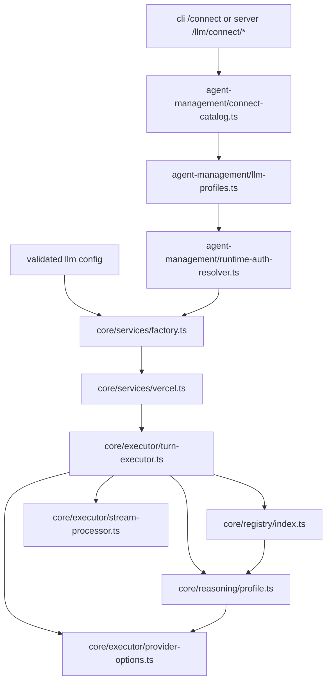
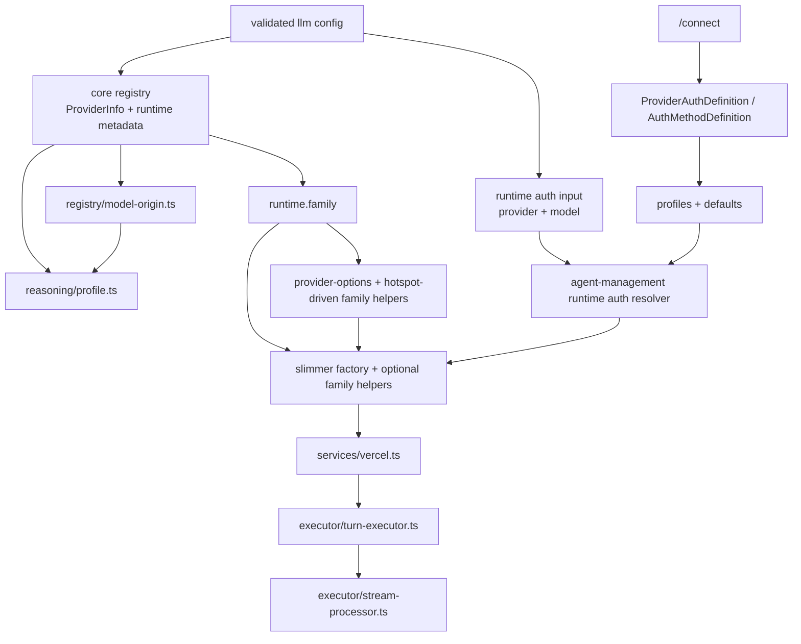
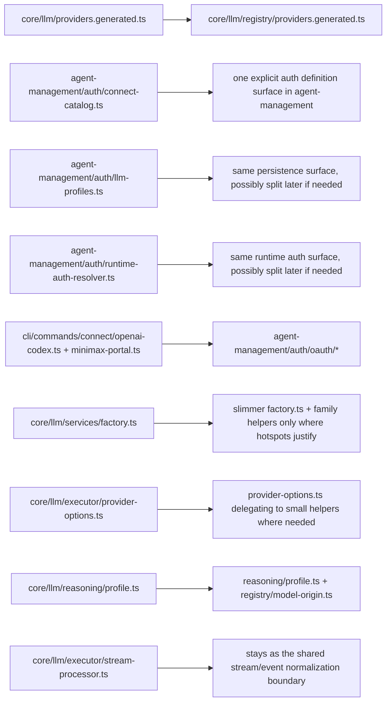
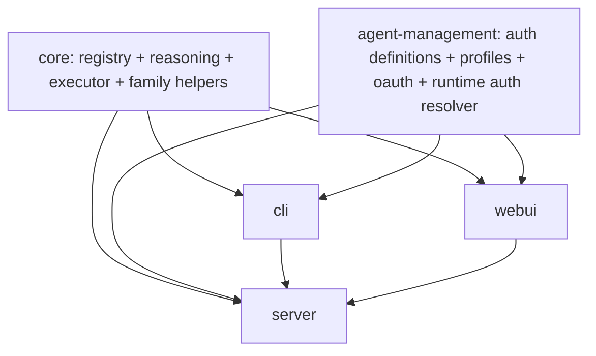

# Proposed Module Tree - Final V2 Shape

Date: **2026-04-02**

This note is aligned with the finalized [`PLAN.md`](./PLAN.md).
Its purpose is to make the module boundaries concrete enough to guide implementation without pretending that every filename below is already locked forever.

The goal is to make it obvious:

- what structure already exists today
- what should stay as-is
- what should move
- what belongs in `core` versus `agent-management`
- where the finalized plan deliberately chose smaller helpers over bigger abstractions

---

## 1. Ownership Summary

### `packages/core`

Owns execution-time truth:

- provider identity used by config and runtime
- generated provider and model registry data
- `runtime.family` / `runtime.category` semantics
- model-origin helpers
- reasoning semantics
- runtime-family-specific execution helpers
- model factory, executor, and `StreamProcessor`

### `packages/agent-management`

Owns user-managed auth state:

- provider-grouped auth definitions
- auth method definitions
- profile persistence and defaults
- OAuth protocol modules
- refresh logic
- runtime auth resolution

### `packages/cli`

Owns terminal UX:

- interactive `/connect`
- provider and method selection UI
- prompts
- spinners
- browser/device-code flow UX
- replace/delete/default actions

### `packages/server`

Owns API exposure:

- `/llm/catalog`
- `/llm/capabilities`
- `/llm/connect/*`
- any future inspection endpoints for connect/runtime metadata

### `packages/webui`

Owns browser UX only:

- connect screens and modals
- model picker UI
- settings surfaces

---

## 2. Current Layout Today

There is already real structure here. The main problem is not "there is no architecture."
The problem is that provider identity, auth method behavior, request family, and model semantics are only partially separated.

### Current core layout

```text
packages/core/src/llm/
  auth/
    types.ts

  executor/
    provider-options.ts
    stream-processor.ts
    tool-output-truncator.ts
    turn-executor.ts
    types.ts

  formatters/
    vercel.ts

  providers/
    codex-app-server.ts
    codex-base-url.ts
    openrouter-model-registry.ts
    local/
      ...

  reasoning/
    profile.ts
    profiles/
      anthropic.ts
      bedrock.ts
      google.ts
      openai.ts
      openai-compatible.ts
      openrouter.ts
      shared.ts
      vertex.ts
    anthropic-betas.ts
    anthropic-thinking.ts
    openai-reasoning-effort.ts

  registry/
    index.ts
    models.generated.ts
    models.manual.ts
    sync.ts
    auto-update.ts

  services/
    factory.ts
    vercel.ts
    index.ts

  curation.ts
  providers.generated.ts
  resolver.ts
  schemas.ts
  types.ts
  validation.ts
```

### Current auth/connect layout

```text
packages/agent-management/src/auth/
  connect-catalog.ts
  llm-profiles.ts
  runtime-auth-resolver.ts

packages/cli/src/cli/commands/connect/
  index.ts
  openai-codex.ts
  minimax-portal.ts
```

### Current runtime control flow



### What the current structure already gets right

- `StreamProcessor` is already the normalization and persistence boundary.
- `TurnExecutor` is already the orchestration loop.
- `reasoning/` already contains real family-specific semantics.
- `registry/` already owns a lot of capability truth.
- `agent-management` already owns credential storage and runtime auth resolution.

### What is still mixed together

- `services/factory.ts`
  - mixes provider identity, runtime-family selection, endpoint presets, and auth-dependent behavior
- `executor/provider-options.ts`
  - mixes provider IDs with request-family reasoning translation
- `reasoning/profile.ts`
  - mixes native providers with gateway-origin inference
- generated provider metadata
  - still lives partly outside `registry/`
- auth method behavior
  - is split across connect catalog metadata, CLI flow branches, and resolver branches

---

## 3. Final V2 Pieces

### `ProviderInfo` plus runtime metadata in `core/registry`

The finalized plan does **not** add a new `ProviderDefinition` registry in phase 1.

Instead, `ProviderInfo` remains the provider metadata surface, and generation adds Dexto-owned runtime metadata to it:

- `runtime.family`
- `runtime.category`

This answers:

- what provider ID config uses
- what runtime family Dexto actually executes through
- what high-level category the provider belongs to
- where generated provider metadata lives

### `ProviderAuthDefinition` / `AuthMethodDefinition` in `agent-management`

The finalized auth surface is provider-grouped and explicit.

It answers:

- what methods the user can choose in `/connect`
- how those methods are displayed
- how credentials are stored
- how OAuth methods start, refresh, and project into runtime auth

Important shape rules from the finalized plan:

- methods are a discriminated union by `kind`
- `api_key`, `token`, and `guidance` stay lightweight
- only `oauth` methods get nested hooks:
  - `oauth.start(...)`
  - `oauth.refresh(...)`
  - `oauth.resolveRuntimeAuth(...)`

### Runtime-family helpers in `core`

This is a responsibility first, not a large framework.

Phase 1 runtime families:

- `openai-responses`
- `openai-completions`
- `anthropic-messages`
- `google-generative-ai`
- `google-vertex`
- `google-vertex-anthropic`
- `bedrock-converse-stream`
- `openrouter`
- `cohere`
- `local-native`

These family helpers answer:

- how to build the SDK/client
- how to translate reasoning controls
- what request quirks exist for the family

At first, this can stay as small modules used by:

- `services/factory.ts`
- `executor/provider-options.ts`

### Model-origin helpers in `core/registry`

This stays as helper logic, not a large abstraction.

It answers:

- for a gateway or proxy model ID, what upstream semantic family/model should Dexto borrow?

Examples:

- `openrouter` or `dexto-nova` model -> upstream Anthropic/OpenAI/Google semantics
- future compatibility/self-hosted endpoints that need semantic mapping

---

## 4. Proposed V2 Shape

This section should be read as implementation guidance, not as a required package-wide move/rename program.

The finalized plan intentionally commits to:

- registry-backed provider metadata plus `runtime.family` / `runtime.category`
- one explicit provider-grouped auth definition surface
- provider-specific OAuth modules where needed
- hotspot-driven helper extraction for runtime families

It does **not** require a blanket one-file-per-family or one-folder-per-concept split in phase 1.

### Phase 1 committed direction

- Move `providers.generated.ts` under `core/llm/registry/`.
- Emit `runtime.family` and `runtime.category` during generation.
- Add `registry/model-origin.ts` for gateway/proxy semantic mapping.
- Introduce one explicit auth definition surface in `agent-management`.
- Move provider-specific OAuth protocol modules out of the CLI and into `agent-management`.
- Extract family helpers from `factory.ts` / `provider-options.ts` only where branch density is already painful.
- Keep method-specific extras in `credential.metadata` for phase 1.
- Do **not** introduce typed per-method persisted schemas in phase 1.

### Proposed control flow



### Low-churn likely file shape

This is the smallest likely module shape that still matches the finalized plan.
It is intentionally less specific than the earlier draft.

```text
packages/
  core/
    src/
      llm/
        auth/
          types.ts

        executor/
          provider-options.ts
          stream-processor.ts
          tool-output-truncator.ts
          turn-executor.ts
          types.ts

        reasoning/
          profile.ts
          profiles/
            anthropic.ts
            bedrock.ts
            google.ts
            openai.ts
            openai-compatible.ts
            openrouter.ts
            shared.ts
            vertex.ts
          anthropic-betas.ts
          anthropic-thinking.ts
          openai-reasoning-effort.ts

        registry/
          index.ts
          providers.generated.ts
          models.generated.ts
          models.manual.ts
          model-origin.ts
          sync.ts
          auto-update.ts

        services/
          factory.ts
          vercel.ts
          index.ts
          families/              # optional: add only for proven hotspots
            openai.ts
            anthropic.ts
            openrouter.ts

        curation.ts
        resolver.ts
        schemas.ts
        types.ts
        validation.ts

  agent-management/
    src/
      auth/
        definitions.ts          # or a small definitions/ folder if it grows

        oauth/
          openai-codex.ts
          minimax-portal.ts
          shared.ts             # optional: only if common oauth helpers actually emerge

        profiles.ts             # or profiles/{store,types}.ts if split helps

        runtime-auth-resolver.ts
```

### Optional later extractions

These are allowed end states, not phase 1 requirements:

- broader `services/families/*` coverage if `factory.ts` remains too branch-heavy
- splitting auth definitions into `definitions/providers/*` if the catalog grows enough to justify it
- splitting `runtime-auth-resolver.ts` into smaller runtime/refresh helpers if the file becomes too large
- splitting `profiles.ts` into `profiles/store.ts` and `profiles/types.ts` if that improves clarity

Anti-goal reminder:

- do not add typed per-method persisted auth schemas in phase 1
- keep method-specific extras in `credential.metadata`

### Current -> likely low-churn mapping



---

## 5. What Each Piece Owns

### `ProviderInfo` plus runtime metadata in `core/registry`

Owns:

- provider ID and display-facing registry metadata
- `runtime.family`
- `runtime.category`
- generated upstream metadata
- support-gating inputs
- where model-origin helpers attach

Should not own:

- OAuth browser logic
- profile persistence
- prompt UX

### `ProviderAuthDefinition` / `AuthMethodDefinition` in `agent-management`

Own:

- provider-grouped auth definitions
- method ID, kind, label, and hint
- OAuth-specific nested hooks
- how credentials map into stored profile data
- how saved credentials become `LlmRuntimeAuthOverrides`
- phase 1 use of `credential.metadata` for method-specific extras

Should not own:

- reasoning semantics
- model registry truth
- low-level execution
- typed per-method persisted auth schemas in phase 1

### Runtime-family helpers in `core`

Own:

- SDK/client construction rules for one runtime family
- request-shape translation
- family-specific reasoning option translation
- family-level request quirks

Should stay small and local:

- plain functions or small modules are enough at first
- only grow into a heavier abstraction if the helper surface becomes large and stable

### Model-origin helpers in `core/registry`

Own:

- mapping gateway/proxy model IDs to upstream semantic families
- normalizing model IDs where needed
- giving reasoning/capability code a safer upstream target when one exists

Should stay simple:

- start as stateless functions in `registry/model-origin.ts`
- do not introduce a class unless multiple implementations or explicit shared state become necessary

---

## 6. Why There Is No New `StreamNormalizer`

After re-reading the current code and finalizing the plan, I still do not think we need a new abstraction here.

`executor/stream-processor.ts` already does the important work:

- consumes streamed events from the SDK
- accumulates assistant text
- accumulates reasoning deltas
- emits normalized Dexto events
- persists tool calls/results and usage data

So the right framing is:

- keep `StreamProcessor`
- let runtime-family helpers shape request behavior
- keep stream/event normalization centralized unless a concrete family proves it cannot fit

In other words:

- small family helpers handle request-time translation
- `StreamProcessor` remains the shared response/event boundary

---

## 7. Unknown vs Unsupported Reasoning Semantics

This distinction is now part of the finalized direction.

Today, when Dexto cannot confidently determine reasoning semantics, it usually falls back to:

- `nonCapableProfile()`
- no explicit reasoning options sent

The v2 direction makes that clearer by explicitly separating:

- `supported`
- `unsupported`
- `unknown`

Safe fallback for unknown models stays:

- let the model run
- do not guess reasoning params
- do not offer false precision in capability reporting
- still accept streamed reasoning output if the SDK emits it

So the change is mostly semantic clarity, not a new runtime fallback.

---

## 8. Recommended Dependency Direction



### Key rule

`core` should not depend on `agent-management`.

Instead:

- `core` exposes runtime auth override contracts in `llm/auth/types.ts`
- `agent-management` implements the runtime auth resolver
- CLI and server wire that resolver into runtime model creation

That matches the current layering and keeps `core` reusable.

---

## 9. Minimal First Refactor Path

If we want the smallest high-value next move consistent with the finalized plan, the path is:

1. Move `providers.generated.ts` under `core/llm/registry/` and emit `runtime.family` / `runtime.category`.
2. Add family-first support gating plus a small exception layer.
3. Introduce `ProviderAuthDefinition` / `AuthMethodDefinition` in `agent-management`.
4. Move provider-specific OAuth protocol modules out of the CLI and into `agent-management/auth/oauth/`.
5. Slim `services/factory.ts` by extracting only the family-specific hotspots that clearly improve readability.
6. If `provider-options.ts` is still too branch-heavy, split small family-specific helpers there too.
7. Add `ReasoningProfile.status` and update capability/reporting surfaces.
8. Keep `StreamProcessor` and align `/connect` with the existing `switchLLM` path rather than inventing a parallel runtime flow.
9. Only split more folders/files if the hotspot-driven extractions above still leave unacceptable sprawl.

That gives the biggest architectural improvement while staying close to the code that already exists.
